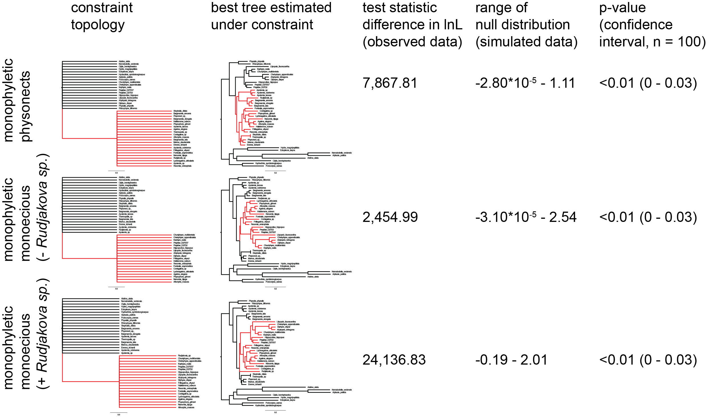

```{r preliminaries, include=FALSE}
	# Load packages

	# General
	library( tidyverse )
	library( stringr )
	library( forcats )
  library( magrittr )
	library( digest )
	library( knitr )
	library( jsonlite )
	library( parallel )

	# Formatting
  library( xtable )

	# Graphics
	library( cowplot )
	library( ggtree )
	library( fields ) # tim.colors
	library( seriation )
	library( gridExtra )
  library( factoextra )
  library( FactoMineR )

	# Biological
	library( hutan )	# https://github.com/caseywdunn/hutan
	library( ape )
	library( picante )  # cor.table
	library( phytools ) # phylosig
  library( vegan )
  library( ggtree )
  library( phangorn )
  library( geiger )
  library( phylobase )
  library( adephylo )
  library( geomorph ) #physig
  library( phylolm )

	# Configure knitr, see http://yihui.name/knitr/options
	opts_knit$set( 
	  progress=TRUE, 
	  verbose=TRUE)
	
	opts_chunk$set(
	#  include=FALSE, 
	  cache=TRUE,
	  echo=FALSE,
	  message=FALSE
	 )

	# Set system computational parameters
	cores = detectCores() - 1
	if ( cores < 1 ) {
		cores = 1
	}
	set.seed( 23456 )

	# Set paths to input data
	tree_path = "agalma/Outfiles/"
	input_file_ml = paste( tree_path, "RAxML_bipartitions.alignment.fa", sep="" )
	input_file_bootstraps = paste( tree_path, "RAxML_bootstrap.alignment.fa", sep="" )
	
	input_files_phylobayes = list.files( 
	  path=tree_path, 
	  pattern="chain\\d+_trimmed60_poisson.treelist" 
	 )
	
	# Analysis parameters
	burn_in = 400
	
```

```{r functions}

  get_node_support = function(  tree, treeset, threshold=100 ){
    # Returns a vector corresponding to nodes in tree, with percent of trees 
    # in treeset that contain the corresponding bipartition
    clades = prop.clades(tree, treeset) / length(treeset)
    nodes = c(rep(NA,length(tree$tip.label)), round(clades*100)) # Offset with NA values for tips
    nodes[ length(tree$tip.label) + 1 ] = NA # Set the root value to NA, not a robust way to find root but works in this case
    
    nodes[ nodes >= threshold  ] = NA
    
    return(nodes)
  }

  gsub2 <- function(pattern, replacement, x, ...) {
  for(i in 1:length(pattern))
  x <- gsub(pattern[i], replacement[i], x, ...)
  x
  }
  
  correctnames =read.csv("tipcorrection.csv") #updating species IDs relative to agalma species IDs

  fix_names = function( tree ){
    # Apply changes to any tip names
    tree$tip.label = sub( '_', ' ', tree$tip.label ) # Change first underscore to space
    tree$tip.label = sub( 'sp_', 'sp', tree$tip.label ) # Fix trailing _ in Physonect sp_
    tree$tip.label = gsub2(correctnames$Agalma.ID, correctnames$Tree.ID,tree$tip.label)
    return( tree )
  }

```


```{r load_data}

	species_tree = ape::read.tree( input_file_ml )
  species_tree = fix_names( species_tree )
  species_tree_unladder =species_tree
  
  bootstrap_trees = ape::read.tree( input_file_bootstraps )
  
  phylobayes_trees = sapply(
    input_files_phylobayes,
    function( pb ) {
      ape::read.tree( 
        paste( tree_path, pb, sep = "" ) 
      )[ -(1:burn_in)  ]
    }
  )
  
  phylobayes_trees = unlist( phylobayes_trees,recursive=FALSE )
  class( phylobayes_trees  ) = "multiPhylo"
  
  bootstrap_trees = lapply( bootstrap_trees, fix_names )
  phylobayes_trees = lapply( phylobayes_trees, fix_names )

  
```

```{r pre_process_species_trees}

	species_tree = ape::ladderize( species_tree )

	species_tree = 
	  ape::root( 
	    species_tree, 
	    c( "Nematostella vectensis", "Aiptasia pallida" ), 
	    resolve.root=TRUE 
	   )
	
  # Repartition length of edges descended from root so they are non-zero
	species_tree = hutan::slide_root_edges( species_tree )

	# species_tree = ape::unroot(species_tree)

	stopifnot( species_tree$Nnode == length( species_tree$node.label ) )

	
	# Make ultrametric tree
	# By default, root has a depth of 1
	species_ultrametric = chronos( species_tree, lambda=1, model="correlated", quiet=TRUE )
	class( species_ultrametric ) = "phylo"

```


# Siphonophore Phylogeny

Catriona Munro^1^\*, Stefan Siebert^1,2^\*, Felipe Zapata^1,3^, Mark Howison^4^, Alejandro Damian Serrano^1,9^, Samuel H Church^1,5^, Freya Goetz^1,6^, Phil Pugh^7^, Steven H.D. Haddock^8^, Casey W. Dunn^1,9^**

^1^ Department of Ecology and Evolutionary Biology, Brown University, Providence, RI 02912, USA

^2^ Current address: Department of Molecular & Cellular Biology, University of California at Davis, Davis, CA 95616, USA

^3^ Current address: Department of Ecology and Evolutionary Biology, University of California Los Angeles, Los Angeles, CA 90095, USA

^4^ Brown Data Science Practice, Brown University, Brown University, Providence, RI 02912, USA

^5^ Department of Organismic and Evolutionary Biology, Harvard University, Cambridge, MA 02138, USA

^6^ Current address: Smithsonian Institution, National Museum of Natural History, Washington, DC 20560, USA

^7^ National Oceanography Centre, Southampton, SO14 3ZH, UK 

^8^ Monterey Bay Aquarium Research Institute, Moss Landing, CA 95039, USA

^9^ Current address: Department of Ecology and Evolutionary Biology, Yale University, New Haven, CT 06520, USA

\* Authors contributed equally

\*\* Corresponding author, casey.dunn@yale.edu

## Abstract

## Introduction

Siphonophores (Fig. 1) are among the most abundant gelatinous predators in the open ocean, and play important ecological roles in oceanic waters [@pugh1984diel;@pugh1997vertical; @williams1981vertical;@purcell1981dietary;@pages2001gelatinous]. Siphonophores, which belong to Hydrozoa (Cnidaria), are found at all depths in the ocean. The most familiar species is the Portuguese man of war *Physalia physalis*, which floats at the surface and can wash up conspicuously onto beaches [@Totton1960]. Most species are planktonic, living in the water column, where some grow to be up to 30 meters in length [@mackie1987siphonophore]. There is also a small clade of benthic siphonophores, the Rhodaliidae [@pugh1983benthic], that are tethered to the bottom for part of their lives. In all, there are currently 188 valid described species.

Siphonophores remain poorly known, in large part because they are fragile and difficult to collect. They have, however, been of great interest for more than 150 years due to their very unique structure and development [@mapstone2014global;@mackie1987siphonophore]. Like many other cnidarians, they are colonial: they grow by incomplete asexual reproduction. Each colony arises from a single embryo that forms the protozooid, the first body. A growth zone then arises that asexually produces other genetically identical zooids [@carre1969etude; @carre1991complete; @carre1967; @carre1995ordre]. These zooids are each homologous to a solitary animal, but are physiologically integrated [@totton1965synopsis; @mackie1987siphonophore; @dunn2006evolution]. Siphonophores differ significantly from all other colonial animals in colony structure, development, and the degree to which they are functionally specialized [@Beklemishev1969;@cartwright2010character]. Each zooid is functionally specialized for a particular task (*e.g.*, feeding, reproducing, swimming) (Fig. 2) [@dunn2006evolution], and they are arranged in a repeating, species-specific pattern.

![Photographs of representatives of the three major groups of siphonophores. Cystonectae (A-B), Calycophorae (C-F) and Physonectae (G-K). (A) *Rhisophysa eysenhardtii*, scale bar = 1 cm. (B) *Bathyphysa conifera*, scale bar = 2cm. (C) *Hippopodius hippopus*, scale bar = 5 mm. (D) *Kephyes hiulcus*, scale bar = 2 mm. (E) *Desmophyes haematogaster*, scale bar = 5 mm. (F) *Sphaeronectes christiansonae*, scale bar = 2 mm. (G) *Nanomia bijuga*, scale bar = 1 cm. (H) *Lychnagalma utricularia*, scale bar = 1 cm. (I) *Physophora hydrostatica*, scale bar = 5 mm. (J) *Praya dubia*, scale bar = 4 cm . (K) *Apolemia* sp., scale bar = 1 cm.](figures/Figure1.jpg)

Understanding the unique ecology, morphology, and development of siphonophores requires an understanding of their phylogenetic relationships. The relationship of siphonophores to other hydrozoans has been difficult to resolve [@cartwright2010character; @Cartwright2008kl; @zapata2015phylogenomic], but there has been progress on their internal relationships. A phylogeny [@Dunn:2005dy] based on two genes (16S, 18S) from 52 siphonophore taxa advanced several long standing questions about siphonophore biology. These include the relationships of the three historically recognised groups, Cystonectae, Physonectae, and Calycophorae. The cystonects were found to be sister to all other siphonophores, while the calycophorans were nested within physonects. The name Codonophora was given to this clade of physonects and calycophorans [@Dunn:2005dy]. 

Major questions remained after this early work, though. There was, in particular, little support for important deep relationships within Codonophora. Resolving these relationships is key to resolving the evolution of several traits, including sexual systems (monoecy versus dioecy) or the gain and loss of particular zooids, such as palpons (Fig. 2). Here we present a broadly sampled phylogenomic analysis of Siphonophora, assessing transcriptomic data from 33 siphonophore species and 10 outgroup species (2 outgroups were subsequently excluded). Using 1,071 genes shared across species, we find strong support for several relationships within the group. Using this phylogeny, we reconstruct the evolutionary history of characters central to their unique biology, including zooid type, life history traits, and habitat. 

![Schematic of the siphonophore *Nanomia bijuga*, oriented with the anterior of the colony at the top, and the ventral side to the left. Adapted from http://commons.wikimedia.org/wiki/File:Nanomia_bijuga_whole_animal_and_growth_zones.svg, drawn by Freya Goetz. (*A*) Overview of the whole mature colony. (*B*) Inset of the nectosomal growth zone with pneumatophore. A series of buds gives rise to nectophores. (*C*) Inset of the siphosomal growth zone. Probuds subdivide to give rise to zooids in repeating-units (cormidia). Cormidial boundaries are marked by a gastrozooid.](figures/Figure2.pdf)


## Methods

All scripts for the analyses are available in a git repository at [https://github.com/caseywdunn/siphonophore_phylogeny_2017](https://github.com/caseywdunn/siphonophore_phylogeny_2017). The most recent commit at the time of the analysis presented here was `r system("git log | head -n 1", intern=TRUE) %>% str_replace("commit ", "")`.


#### Collecting

Specimens were collected in the eastern Pacific Ocean, Mediterranean, and the Gulf of California. Collection data on all examined specimens, a description of the tissue that was sampled from the colony, collection mode, sample processing details, mRNA extraction methods, sequencing library preparation methods and sequencing details are summarized in Supplementary Information. Monterey Bay and Gulf of California specimens were collected by remotely operated underwater vehicle (ROV) or during blue-water SCUBA dives. *Chelophyes appendiculata* and *Hippopodius hippopus* specimens were collected in the bay of Villefranche-sur-Mer, France, during a plankton trawl on 13 April 2011. Available physical vouchers have been deposited at the Museum of Comparative Zoology (Harvard University), Cambridge, MA, the Peabody Museum of Natural History (Yale University), New Haven, CT, or had been previously deposited at the United States National Museum (Smithsonian Institution), Washington, DC. Accession numbers are given in Supplementary Information. In cases where physical vouchers were unavailable we provide photographs to document species identity (see git repository).

#### Sequencing

When possible, specimens were starved overnight in filtered seawater at temperatures close to ambient water temperatures at the time point of specimen collection (see supplementary document). mRNA was extracted directly from tissue using a variety of methods (see supplementary document): Magnetic mRNA Isolation Kit (NEB, #S1550S), Invitrogen Dynabeads mRNA Direct Kit (Ambion, #61011), Zymo Quick RNA MicroPrep (Zymo #R1050), or from total RNA after Trizol (Ambion, #15596026) extraction and through purification using Dynabeads mRNA Purification Kit (Ambion, #61006).  In case of anticipated very small total RNA quantities, only a single round of bead purification was performed; or Trizol extraction of total RNA directly into the Illumina TruSeq Stranded Library Kit. Extractions were performed according to the manufacturer's instruction. All samples were DNase treated (TURBO DNA-free, Invitrogen #AM1907;or on column DNase treatment with Zymo Quick RNA MicroPrep). Libraries were prepared for sequencing using the Illumina TruSeq RNA Sample Prep Kit (Illumina, #FC-122-1001, #FC-122-1002), the Illumina TruSeq Stranded Library Prep Kit (Illumina, #RS-122-2101) or the NEBNext RNA Sample Prep Master Mix Set (NEB, #E6110S). We collected long read paired end Illumina data for *de novo* transcriptome assembly. In the case of large tissue inputs, libraries were sequenced separately for each tissue, subsequently subsampled and pooled *in silico*. Libraries were sequenced on the HiSeq 2000, 2500, and 3000 sequencing platforms. 

#### Analysis

New data were analysed in conjunction with 13 publically available datasets, with a total number of 43 species. Sequence assembly, annotation, and Maximum Likelihood (ML) phylogenetic analysis were conducted with the tool Agalma v. 1.00 [@Dunn:2013kw; @Guang202416], and Bayesian Inference (BI) analyses were conducted using Phylobayes v. 1.7a-mpi [@lartillot2009phylobayes]. Sequence alignments, sampled and consensus trees, and voucher information are available in a git repository https://github.com/caseywdunn/siphonophore_phylogeny_2017. All sequence data have been deposited in the NCBI sequence read archive (SRA).

Two outgroup species, *Atolla vanhoeffeni* and *Aegina citrea*, were removed from the final supermatrix due to low gene occupancy (gene sampling of 20.8% and 14.5% respectively in a 50% occupancy matrix with 2,203 genes). ML analyses were conducted on the unpartitioned supermatrix using the WAG+$\Gamma$ model of amino acid substitution, and bootstrap values were estimated using 1000 replicates. BI was conducted using two different CAT models, CAT-Poisson and CAT-GTR [@doi:10.1093/molbev/msh112]. Two independent MCMC chains were run under the CAT-GTR model, and four independent MCMC chains were run under the CAT-Poisson model. The CAT-GTR and CAT-Poisson models did not converge, and only the results from the CAT-Poisson model are included here. The analyses presented here consider 33 siphonophore species and 8 outgroup species. This includes new data for 30 species. Summary statistics for expression libraries are given in Supplementary Information. In the final analyses, we sampled 1,071 genes to generate a supermatrix with 60% occupancy and a length of 378,468 amino acids (gene occupancy matrix - supplementary figure 1). 

Maximimum likelihood analyses had `r length(bootstrap_trees)` replicates. We ran `r length( input_files_phylobayes )` phylobayes chains, and visual inspection of the traces indicated that a burn in of `r burn_in` trees was sufficient for all runs. This left `r length( phylobayes_trees )` trees in the posterior. The phylobayes chains did not converge, and uncertainty remains around the placement of *Erenna richardi*, and also *Nanomia bijuga*. Within the ML analysis, the placement of *Erenna richardi* is also unstable. Alternative topologies for these nodes are shown in figure 3. 

Morphological character data used in trait mapping were obtained from the literature or direct observation of available voucher material. Depth distribution data was queried from the MBARI VARS ( http://www.mbari.org/products/research-software/video-annotation-and-reference-system-vars/, [@schlining2006mbari]) database. We used stochastic character mapping to infer the probable evolution of traits on the tree in R using the `phytools` package [@MEE3:MEE3169; @huelsenbeck2003stochastic]. Subsequent analyses were conducted in R and integrated into this manuscript with the `knitr` package. See Supplementary Information for R package version numbers.

#### Hypothesis testing
We used the Swofford-Olsen-Waddell-Hillis (SOWH) test [@swofford1996phylogenetic] to evaluate two hypotheses: (i) physonects are monophyletic [@totton1965synopsis]; (ii) monoecious species are monophyletic [@Dunn:2005dy]. As the sexual system of *Rudjakovia* sp. is unclear, we carried out two tests of the monophyly of monoecy, one with *Rudjakovia* sp. included as a monoecious species, and one without. We used SOWHAT [@doi:10.1093/sysbio/syv055] dev. version 0.39 (commit fd68ef57) to carry out the SOWH tests in parallel with the default options and an initial sample size of 100 (source code can be found in the git repository). For each hypothesis we defined a topology with a single constrained node that was inconsistent with the most likely topology (Fig. 3). We used a threshold for significance of 0.05 and following the initial 100 samples, we evaluated the confidence interval around the p-value to determine if more samples were necessary.  

## Results and Discussion

### Species phylogeny and hypothesis testing

```{r specimen_summary, results='asis', echo=FALSE, comment=NA, warning=FALSE}
specimen_data <- read.csv("supplementary_info/Supplementary_data_1_Specimen_data.csv")
names(specimen_data)<-c("New data","Species","ID","SRA Number", "Library ID", "Library type","Tissue","Sequencer", "Sequencing center", "Sample prep","Collected by","Collection date","Specimen id","Depth (m)","Geo loc name","Lat Lon","Voucher Type","Voucher location","Voucher Cat No.","Collection mode")

specimen_data_reduced <- specimen_data[,c(1,2,4,14,16)]
specimen_data_reduced$`New data`<-sub("^N"," ",specimen_data_reduced$`New data`)

xtable_specimen<-xtable(specimen_data_reduced,auto=TRUE, caption="Table 1. A complete list of specimens collected for this work. New data indicated by Y, blank fields indicate that data are already published.")
print(xtable_specimen,comment=F, include.rownames=FALSE, scalebox='0.75')

```

```{r species_phylogram, echo=FALSE, comment=NA, warning=FALSE }

	siphonophora_node = ape::mrca( species_tree )[ "Physalia physalis", "Agalma elegans" ]
	cystonectae_node = ape::mrca( species_tree )[ "Physalia physalis", "Rhizophysa filiformis" ]
	calycophora_node = ape::mrca( species_tree )[ "Kephyes ovata", "Hippopodius hippopus" ]
	euphysonectae_node = ape::mrca( species_tree )[ "Agalma elegans", "Erenna richardi" ]

	support = as.numeric( species_tree$node.label )
	support[ support > 99 ] = NA

	# pad tip values
	support = c( rep( NA, length( species_tree$tip.label ) ), support )
  
	p_phylogram = ggtree( species_tree ) +
			# geom_text( aes( label=support ), vjust=-.5, hjust=1, size=2.5, col="darkslategray4" ) +
	    geom_text(aes(label=get_node_support(species_tree, bootstrap_trees)), vjust=-.5, hjust=1, size=2.5, col="red") +
      geom_text(aes(label=get_node_support(species_tree, phylobayes_trees)), vjust=1.5, hjust=1, size=2.5, col="blue") +
			geom_tiplab( size=3 ) +
			xlim( NA, 4 ) +
			geom_cladelabel( node=cystonectae_node, label="Cystonectae", align=FALSE, offset=1, color='red' ) +
			geom_cladelabel( node=calycophora_node, label="Calycophora", align=FALSE, offset=1, color='blue' ) +
			geom_strip(
				which( species_tree$tip.label=="Agalma elegans" ),
				which( species_tree$tip.label=="Apolemia white" ),
				barsize=0.5,
				color='orange',
				offset=1,
				label='"Physonectae"'
			) +
			geom_strip(
				which( species_tree$tip.label=="Hydractinia symbiolongicarpus" ),
				which( species_tree$tip.label=="Nematostella vectensis" ),
				barsize=0.5,
				color='gray',
				offset=1,
				label='"Outgroups"'
			)
	
pdf("figures_raw/figure_3_raw.pdf")
flip( p_phylogram, euphysonectae_node, calycophora_node )
dev.off()

```

The phylogenetic relationships recovered in this study are largely consistent with a previous analysis based on two genes (16S and 18S ribosomal RNA) (Fig. 3) [@Dunn:2005dy]. There is strong support for the Cystonectae as sister to all other siphonophores, the Codonophora. We also find strong support for Calycophorae nested within the paraphyletic "Physonectae", and for the Apolemidae as sister to all other codonophorans. Multiple nodes that were not resolved in the previous two-gene analysis receive strong support in this 1,071-gene transcriptome analysis. There is strong support for the Pyrostephidae as sister to all other non-apolemiid codonophorans. Within the clade that is sister to the Pyrostephidae, we find two main clades, the Calycophorae and a clade we call the Euphysonectae (Fig. 3), which includes the remaining non-apolemiid, non-pyrostephid "Physonectae". We define the Euphysonectae as the clade consisting of *Agalma elegans* and all taxa that are more closely related to it than to *Diphyes dispar*. Within Euphysonectae, we identify Clade A and Clade B (Fig. 3). Clade A is a group of siphonophores that all have an involucrum, or fold, that forms around the base of the tentilla [@totton1965synopsis]. This clade also shares the prescence of a descending mantle canal within the nectophores (Fig. S6), and is also monoecious (Fig. 5). Within Clade B there is low support for the placement of *Erenna richardi*, and more taxon sampling will be required to determine the relationship of species within this clade.

Within Clade A, *Physophora gilmeri* along with *Lychnagalma utricularia* (both not included in the previous phylogeny) are sister to the Agalmatidae, a clade restricted to *Agalma*, *Athorybia*,*Melophysa*, *Halistemma* and *Nanomia* [@Dunn:2005dy; @pugh2006taxonomic]. In the rDNA study, *Physophora hydrostatica* (sister species to *P. gilmeri*) was sister to the Forskaliidae with low support. The position of *Cordagalma cordiforme* (= *Cordagalma ordinatum*) [@pugh2016synopsis] was previously unresolved, while in this analysis *Cordagalma* sp. is in a clade with *Forskalia asymmetrica*, falling outside of the Agalmatidae. Placement of *Cordagalma* outside Agalmatidae is consistent with previous analyses using morphological and molecular data [@pugh2006taxonomic;@Dunn:2005dy].

Within the calycophorans, taxon sampling is shallower, however there is broad agreement with the previous analysis. Calycophorans have in the past been split into convenient groupings of prayomorph and diphyomorph based on morphology (after @mackie1987siphonophore). As in the previous study, this phylogeny indicates that the prayomorphs are paraphyletic with respect to the diphyomorphs. *Craseoa lathetica* and *Desmophyes* sp. are sister to *Hippopodius hippopus* in this study, while in the previous study, the relationship between *Craseoa lathetica* and the clade including *Hippopodius hippopus* was unresolved.  

![Phylogram of siphonophore relationships. Node labels indicate bootstrap support percent, unnumbered nodes have 100% support. The image was rendered with ggtree [@Yu:2016fo].](figures/Figure3.pdf)

We tested the following three alternative phylogenetic hypotheses against the most likely tree topology: (i) physonect siphonophores are monophyletic, (ii) monoecious siphonophores (not including *Rudjakovia* sp.) are monophyletic, and (iii) monoecious siphonophores (including *Rudjakovia* sp.) are monophyletic (Fig. 3 xx). In all three cases the alternative hypothesis was rejected (p-value <0.01, confidence interval: <0.001 - 0.03, Fig. S2).

## Character Evolution
```{r char_evo_setup, include=F, echo=F}
#Load data
read.csv('character_coding/main_characters.csv', header = T, sep = ',') -> cdata
rownames(cdata) = cdata$Species

#Load tree
tree = species_tree_unladder
tree <- drop.tip(tree, which(!(tree$tip.label %in% rownames(cdata))))
#tree<-rotateNodes(tree,nodes=c(28,31))

ultratree <- chronos(tree)
class( ultratree ) = "phylo"
nodes_to_rotate = c(ape::mrca(ultratree)["Physalia physalis","Kephyes ovata"], ape::mrca(ultratree)["Bargmannia lata","Hippopodius hippopus"])
ultratree<-rotateNodes(ultratree,nodes=nodes_to_rotate)

#Temporarily prune data
cdata %<>% filter(rownames(.) %in% tree$tip.label)
rownames(cdata) = cdata$Species
cdata %<>% .[-1]

#Named vectors for variables
sex = cdata$Sex
names(sex) = rownames(cdata)

nectosome = cdata$Nectosome
names(nectosome) = rownames(cdata)

palpons = cdata$Palpons
names(palpons) = rownames(cdata)

tentilla = cdata$Tentilla
names(tentilla) = rownames(cdata)

tentilla2 = tentilla
tentilla2['Physalia physalis'] = 1 #In the scenario where we consider Physalias knobs reduced not lost tentilla

bracts = cdata$Bract.types
bracts[which(bracts>0)] <- 1  #bracts changed to presence absence for tip annotation
names(bracts) = rownames(cdata)
cdata$Bract.types = bracts
names(cdata)[8] = "Bracts"

#Depth pruned data
dpruned_data = cdata[which(!is.na(cdata$Depth.Median)), ]
dpruned_tree <- drop.tip(ultratree, which(!(ultratree$tip.label %in% rownames(dpruned_data))))
dpruned_data <- dpruned_data[match(dpruned_tree$tip.label, rownames(dpruned_data)),]

depth_median = dpruned_data$Depth.Median
names(depth_median) = rownames(dpruned_data)
```

```{r simmap_making, echo=F, message=F, warning=F, include=F}
#Stochastic trait mapping:
#Make simmap objects
#print("SIMMAP Sex Distribution")
make.simmap(ultratree, sex, nsim = 100, message=FALSE) -> sex_sim
#print("SIMMAP Palpons")
make.simmap(ultratree, palpons, nsim = 100, message=FALSE) -> palpons_sim
#print("SIMMAP Tentilla")
make.simmap(ultratree, tentilla, nsim = 100, message=FALSE) -> tentilla_sim
#print("SIMMAP Tentilla2")
make.simmap(ultratree, tentilla2, nsim = 100, message=FALSE) -> tentilla_sim2
#print("SIMMAP Nectosome")
make.simmap(ultratree, nectosome, nsim = 100, message=FALSE) -> nectosome_sim
#print("SIMMAP Nectosome Position")
make.simmap(ultratree, bracts, nsim = 100, message=FALSE) -> bracts_sim
#print("SIMMAP Habitat")

#Nectophore position SIMMAP setup
necto_pos_data = cdata[which(cdata$Nectosome.position != "None"),]
necto_pos = necto_pos_data$Nectosome.position
names(necto_pos) = rownames(necto_pos_data)
NectoPosTree = drop.tip(ultratree, which(!(ultratree$tip.label %in% names(necto_pos))))
make.simmap(NectoPosTree, necto_pos, nsim = 100, message=FALSE) -> necto_pos_sim

#Descending mantle Canal SIMMAP Setup
desc_mantle_data = cdata[which(!is.na(cdata$Desc.Mantle.Canal)),]
desc_mantle = desc_mantle_data$Desc.Mantle.Canal
names(desc_mantle)=rownames(desc_mantle_data)
DescMantleTree =  drop.tip(ultratree, which(!(ultratree$tip.label %in% names(desc_mantle))))
make.simmap(DescMantleTree, desc_mantle, nsim = 100, message=FALSE) -> desc_mantle_sim
```

```{r sex, echo=F, message=F, warning=F, include=F}
par(ask=F)
#Simmap SEX
plotTree(ultratree, lwd = 4)
colors = c("black", "red")
names(colors) = c("Dioecious", "Monoecious")
sex_sim %>% plotSimmap(lwd = 4, add = T, colors=colors)
nodelabels(pie=(describe.simmap(sex_sim, plot=F)$ace) ,piecol=colors,cex=0.35)
add.simmap.legend(colors = colors, x=0.6*par()$usr[1],y=0.3*par()$usr[4],prompt=FALSE)
sex_obj <- densityMap(sex_sim, plot=FALSE)
sex_obj$cols[1:length(sex_obj$cols)]<-colorRampPalette(colors=c("#4A4ACC", "orange"), space="Lab")(length(sex_obj$cols))
 pdf("figures_raw/figure_5_raw_sex.pdf")
 plot(sex_obj)
 dev.off()
```

```{r palpons, echo=F, message=F, warning=F, include=F}
#Simmap PALPONS
 plotTree(ultratree, lwd = 4)
 colors = c("black", "red")
 names(colors) = c("Absent", "Present")
 palpons_sim %>% plotSimmap(lwd = 4, add = T,colors=colors)
 nodelabels(pie=(describe.simmap(palpons_sim, plot=F)$ace) ,piecol=colors,cex=0.35)
 add.simmap.legend(colors = colors, x=0.6*par()$usr[1],y=0.3*par()$usr[4],prompt=FALSE)
palpons_obj <- densityMap(palpons_sim, plot=FALSE)
palpons_obj$cols[1:length(palpons_obj$cols)]<-colorRampPalette(colors=c("#4A4ACC", "orange"), space="Lab")(length(palpons_obj$cols))
 pdf("figures_raw/figure_5_raw_palpons.pdf")
 plot(palpons_obj)
 dev.off()
```

```{r vars_plot, echo=F, message=F, warning=F, include=F}
#Get Raw Data
raw_data = read.csv(file="character_coding/trim_siphdepths.tsv", sep = "\t")[,c(4,3,5:11)]
raw_data = raw_data[order(raw_data$ConceptName),]

#Clean Raw Data
names(raw_data)[1] = "Species"
raw_data$Species = as.character(raw_data$Species)
raw_data$Species[which(raw_data$Species == "Kephyes")] = "Kephyes ovata"
raw_data$Species[which(raw_data$Species == "Lilyopsis")] = "Lilyopsis fluoracantha"
raw_data$Species[which(raw_data$Species == "Agalma")] = "Agalma elegans"
raw_data$Species[which(raw_data$Species == "Frillagalma")] = "Frillagalma vityazi"
raw_data$Species[which(raw_data$Species == "Stephalia")] = "Stephalia dilata"
raw_data$Species[which(raw_data$Species == "Lychnagalma")] = "Lychnagalma utricularia"
raw_data$Species[which(raw_data$Species == "Craseoa")] = "Craseoa lathetica"
raw_data$Species[which(raw_data$Species == "Cordagalma")] = "Cordagalma sp"
raw_data$Species[which(raw_data$Species == "Desmophyes haematogaster")] = "Desmophyes sp"
raw_data$Species[which(raw_data$Species == "Rudjakovia")] = "Rudjakovia sp"
raw_data$Species[which(raw_data$Species == "Physonectae sp. 1")] = "Undescribed sp L" 

#Adjust Data to tree structure
raw_data[which(raw_data$Species %in% ultratree$tip.label),] -> intree_data
tree$tip.label[which(!(ultratree$tip.label %in% raw_data$Species))] %>% length() -> missSPP
missing_data_proxy <- raw_data[1:missSPP,]
missing_data_proxy$Species = ultratree$tip.label[which(!(ultratree$tip.label %in% raw_data$Species))]
missing_data_proxy$Depth = rep(20, missSPP)
parched_data <- rbind(missing_data_proxy, raw_data[which(raw_data$Species %in% ultratree$tip.label),])
parched_data = parched_data[which(!is.na(parched_data$Depth)),]
parched_data$Species <- factor(parched_data$Species, levels = ultratree$tip.label)

#90% Cut-off of extrame values
SPDepths = parched_data[,1:2]
byspp_SPD = split(SPDepths, SPDepths$Species)
for(i in 1:length(byspp_SPD)){
  if(nrow(byspp_SPD[[i]])>200){
#   byspp_SPD[[i]] = sample_n(byspp_SPD[[i]], 0.02*nrow(byspp_SPD[[i]]))
    byspp_SPD[[i]] = sample_n(byspp_SPD[[i]], 200)
  }
}
trimmed_SDdata = bind_rows(byspp_SPD)

sp_order = c("Agalma elegans", "Athorybia rosacea", "Halistemma rubrum", "Nanomia bijuga", "Lychnagalma utricularia", "Physophora gilmeri", "Forskalia asymmetrica", "Cordagalma sp.", "Resomia ornicephala", "Frillagalma vityazi", "Undescribed Sp. L", "Marrus claudanielis", "Stephalia dilata", "Stephalia sp.", "Erenna richardi", "Abylopsis tetragona", "Diphyes dispar", "Chelophyes appendiculata", "Kephyes ovata", "Chuniphyes multidentata", "Lilyopsis fluoracantha", "Craseoa lathetica", "Desmophyes sp.", "Hippopodius hippopus", "Bargmannia amoena", "Bargmannia elongata", "Bargmannia lata", "Rudjakovia sp", "Apolemia rubriversa", "Apolemia lanosa", "Apolemia sp.", "Rhizophysa filiformis", "Physalia physalis")

trimmed_SDdata$Species = as.character(trimmed_SDdata$Species)
trimmed_SDdata = trimmed_SDdata[which(!is.na(trimmed_SDdata$Species)),]
trimmed_SDdata$Species <- factor(trimmed_SDdata$Species, levels = sp_order)

#ggplot(trimmed_SDdata, aes(x = Species, y=-Depth)) + geom_boxplot() + theme_classic()

 pdf("figures_raw/figure_4_raw_violin.pdf")
 ggplot(trimmed_SDdata, aes(x = Species, y=-Depth)) + geom_violin() + theme_classic()
 dev.off()
```

```{r ggtree_bin_heatmap, echo=F, message=F, warning=F, include=F}
p <- ggtree(ultratree)
p <- p + geom_tiplab(size=2.2)
f_cdata = sapply(cdata, as.factor) %>% as.data.frame %>% .[c(1,2,5:9,17,18,3)]
rownames(f_cdata) = rownames(cdata)
f_cdata = f_cdata[,c(7,4,1,3,6,2,10,8,9,5)]
f_cdata[match(tree$tip.label,rownames(f_cdata)),]

 pdf("figures_raw/figure_4_raw_heat.pdf")
 gheatmap(p, f_cdata, offset = 0.4, width=0.5, colnames_position = 'top', font.size = 1)
 dev.off()
```

###Evolution of Monoecy

In all siphonophores, each gonophoren(sexual medusa that produces gametes) is either male or female. Siphonophore colonies are either monoecious (male and female gonophores are on the same colony) or dioecious (male and female gonophores are on different colonies). The current better-resolved tree (Fig. 5A), indicates that monoecy in siphonophores evolved twice from a dioecious ancestor, in the branch leading to Calycophorae and in the branch leading to Clade A. There is a small probability for an alternative scenario featuring a single gain of monoecy before the split of Codonophora, with a subsequent shift to dioecy in the *Marrus-Erenna* clade. Previous analyses suggested that the common ancestor of siphonophores was dioecious, and there is a single gain of monoecy within the Codonophora [@Dunn:2005dy].

The Calycophorae and Clade A each have very different arrangements of male and female gonophores, providing evidence for multiple gains of monoecy. In both the Calycophorae and Clade A, male and female gonophores are located within the same colony. In calycophorans, each cormidium (a single reiterated sequence of zooids along the stem, see Fig. 2) bears either male or female zooids. In this form of monoecy, the male and female cormidia can either be in an alternating pattern, or there can be several male or female cormidia in a row. In either case, male and female zooids are found at the same corresponding locations within the cormidia. In Clade A, however, male and female zooids are found within the same cormidium.In these species, the male and female zooids are placed at very different but well defined locations within the cormidium.

###The Evolution of Zooid Types

One of the most striking aspects of siphonophore biology is their diversity of unique zooid types [@Beklemishev1969;@cartwright2010character]. For example, the genus *Forskalia* has 5 basic zooid types (nectophore, gastrozooid, palpon, bract, and gonophore), and in some species, a total of 9 when considering zooid subtypes (4 types of bract, male & female gonophores)[@pugh2003revision]. Diphyomorphs have more than one type of propulsive nectophore, while cystonects have none. Here we reconstruct the evolutionary origins of several zooid types on the present transcriptome tree (Fig. 4).

Nectophores are non-reproductive propulsive medusae that codonophorans use for coordinated colony-level swimming (Fig. 2). Nectophores are also present within the gonodendra (reproductive structures) of the cystonects, and are thought to propel the gonodendra when they detach from the colony [@totton1965synopsis;@Totton1960]. It is not clear whether the nectophores found within the siphosome of the cystonects are homologous to the nectophores borne on the nectosome of codonophorans. The nectosome is the region of the colony that develops from the nectosomal growth zone (Fig. 2B). Unlike the siphosomal growth zone, the nectosomal growth zone does not bud gastrozooids, but nectophores (and in the case of *Apolemia*, also palpons). The present tree, as well as the analyses of @Dunn:2005dy, are consistent with a single origin of the nectosome (Fig. S5). 


The nectosome can be located in a dorsal or a ventral position, following the orientation framework of @haddock_dunn_pugh_2005. Our ancestral reconstructions for this character (Fig. S8) show that a ventrally-oriented nectosome was the ancestral form in Codonophora, and that a dorsal nectosome has evolved twice independently, in the branch leading to Agalmatidae and the branch leading to the *Bargmannia* species.

Bracts are highly reduced zooids unique to siphonophores, where they are only present in Codonophora (Fig. 4). Bracts are functional for protection of the delicate zooids and to help maintain neutral buoyancy [@jacobs1937beobachtungen]. Some calycophorans are able to actively exclude sulphate ions in their bracts to adjust their buoyancy along the colony [@bidigare1980role]. The common ancestor of Codonophora had only one bract subtype, which was lost in Hippopodidae, *Physophora hydrostatica*, Clausophyidae, and in *Gymnopraia lapislazula* (none of the latter three species and clades are included in the phylogeny). These patterns of loss are not captured by the present sampling.

Palpons are modified reduced gastrozooids used for digestion and circulation of the gastrovascular fluid [@mackie1987siphonophore]. We do not distinguish here between gonopalpons (palpons associated with gonodendra, without a tentacle, as in the cystonects) and palpons borne on the stem (typically with a reduced tentacle or palpacle) [@totton1965synopsis]. We reconstruct them as present in the common ancestor of siphonophores (Fig. 5B), retained in most species, but lost three times independently in the branches leading to *Pyrostephidae* (represented here by the genera *Bargmannia* and *Rudjakovia*), in calycophorans, and in *Marrus claudanielis*. Within the calycophorans, one species *Stephanophyes superba* (not included in this phylogeny) has polyp-like zooids that have been described as palpons [@totton1965synopsis], but the exact identity of this zooid is not clear and needs further morphological examination.


###The Gain and Loss of the Pneumatophore

The pneumatophore is a gas filled float located at the anterior end of the colony, which helps the colony maintain its orientation in the water column, and plays a role in flotation in the case of the cystonects [@church2015histology;@mackie1974locomotion; @totton1965synopsis]. It is not considered a zooid, as it is not formed by budding but by invagination at the aboral end of the planula during early development [@garstang1946morphology; @leloup1935siphonophores; @carre1969etude]. Recent evidence of neural arrangement in the pneumatophore of *Nanomia bijuga*  suggests it could also gather information on relative pressure changes (and thus depth changes), helping regulate geotaxis [@church2015histology]. The ancestral siphonophore had a pneumatophore (Fig. 2B), since both cystonects and most codonophorans possess one (Fig. 4). The pneumatophore was lost in Calycophorae and never gained again in that clade. Calycophorans rely on the ionic balance of their gelatinous nectophores and bracts to retain posture and neutral buoyancy [@mackie1974locomotion].

###The Gain and Loss of Tentilla

The most complex nematocyst batteries of Cnidaria can arguably be found among the siphonophores, hanging in regularly spaced tentacle side branches called tentilla (Fig. 2A). Most hydrozoans bear simple tentacles (tentacles with no side branches). It is still an open question whether the common ancestor of Siphonophora had tentilla. The only siphonophores species regarded as lacking tentilla are *Physalia physalis*, *Apolemia* spp., and *Bathyphysa conifera*. Since *B. conifera* is the only member of the *Rhizophysidae* (and of the *Bathyphysa* genus) lacking tentilla, we can safely assume this is a case of secondary loss. When we reconstruct the evolution of this character on the current phylogeny, 70% of simulations support an common ancestor bearing tentilla, with two independent losses leading to *Physalia* and *Apolemia* (Fig. S3). However, this leaves a 30% support for a simple-tentacled common ancestor followed by 2 independent gains of tentilla in the branches leading to *Rhizophysidae* and non-apolemiid codonophorans.

How we define absence of tentilla, especially for *Physalia physalis*, is also important. The tentacles of this species, when uncoiled, show very prominent, evenly spaced, bulging buttons which contain on their ectoderm all active and functionally arranged nematocysts used by the organism for prey capture [@Totton1960;@BARDI2007]. Siphonophore tentilla are complete diverticular branchings of the tentacle ectoderm, mesoglea, and gastrovascular canal (lined by endoderm).  *Physalia*'s buttons enclose individual fluid-filled chambers connected by narrow channels to the tentacular canal, lined by endoderm [@Hessinger1988]. This suggests they are not just ectodermal swellings, but probably reduced tentilla. When we define *Physalia physalis* as tentilla bearing, the results for the character reconstruction lead to a more robust support for a tentilla-bearing common ancestor followed by independent losses of tentilla in the branch leading to *Apolemiidae* (Fig. S4), and in *Bathyphysa conifera*.

###The Evolution of Vertical Habitat Use

Siphonophores are abundant predators in the pelagic realm, ranging from the surface (*Physalia physalis*) to bathypelagic depths (Fig. 4, S9) [@mapstone2014global; @mackie1987siphonophore]. However, the depth distribution of siphonophore populations is not always static. Many species are strong vertical migrators, and some species such as *Chuniphyes multidentata* have exhibited synchronous diel migration patterns [@pugh1984diel]. Some siphonophore species (such as *Bargmannia lata*) have been observed at abyssopelagic depths near 4000m. Using the present phylogeny, we reconstructed the median depth changes along the phylogeny under a Brownian Motion model (Fig. S9). This model indicates a mesopelagic common ancestor, with several independent transition events to epipelagic (light blue) and bathypelagic (dark blue) waters. This reconstruction only included species recorded using an ROV, thus it excludes many other independent colonizations of the epipelagic habitat. The ROV observations are reliable below 200m, and no quantative measurements were made on SCUBA dives. Species such as *Hippopodius hippopus*, *Athorybia rosacea*, *Diphyes dispar*, and *Chelophyes appendiculata* are often encountered blue water diving less than 20m from the surface (Fig. 4). We also reconstructed the median depth changes along the phylogeny using median depths of 20m for all species collected by SCUBA diving (Fig. S10), and still find support for a mesopelagic ancestor. There was only a single transition to benthic lifestyle on the branch of *Rhodaliidae*, and a single transition to a pleustonic lifestyle on the branch of *Physalia physalis*. 

## Conclusions
Using phylogenomic tools we were able to resolve deep relationships within Siphonophora with strong support. A previous rRNA study was unable to resolve deep relationships within the Codonophora, while our study suggests that the Pyrostephidae are sister to all other non-apolemiid codonophorans. Our study supports the rejection of the monophyly of the Physonectae, a traditional morphological grouping, and rejects the monophyly of monoecious siphonophores. Future studies with the addition of key taxa within Codonophora will enable resolution of internal relationships within Siphonophora, and shed light on patterns of character evolution that cannot be fully assessed here.  

## Acknowledgements

This work was supported by the National Science Foundation (DEB-1256695 and the Waterman Award). Sequencing at the Brown Genomics Core facility was supported in part by NIH P30RR031153 and NSF EPSCoR EPS-1004057. Data transfer was supported by NSF RII-C2 EPS-1005789. Analyses were conducted with computational resources and services at the Center for Computation and Visualization at Brown University, supported in part by the NSF EPSCoR EPS-1004057 and the State of Rhode Island. SOWHAT analyses were carried out on the Odyssey cluster supported by the FAS Division of Science, Research Computing Group at Harvard University -- we thank Cassandra Extavour for use of the Harvard cluster. We thank Rob Sherlock for providing the *Bathyphysa conifera* photograph. We also thank the MBARI crews and ROV pilots for collection of the specimens.

## Supplementary Information
\setcounter{figure}{0}
\setcounter{table}{0}
\makeatletter 
\renewcommand{\thefigure}{S\@arabic\c@figure}
\renewcommand{\thetable}{S\@arabic\c@table}
\makeatother

####Agalma analysis




```{r summary_table, results='asis', echo=FALSE, comment=NA, warning=FALSE}

####The supplementary table is too long. We decided to include as a supplementary datafile instead

#	summary_stats = read.table("supplementary_info/Library_summary.csv", header=TRUE, sep=",")
#	names(summary_stats)<-c("Species","Mean insert size (bp)","Insert size sd","# read pairs","% kept after rRNA removal","% kept after assembly","Adapter fails","Quality fails","Base Comp. fails","Total transcripts","Coding transcripts") 
	
#xtable_summary<-xtable(summary_stats, caption="Supplementary table 1.The assembly summary statistics for all included taxa, showing mean insert size, and the percentage of reads kept after pipeline steps.")
#align( xtable_summary ) <- c('l|','p{0.8in}','p{0.3in}','p{0.3in}','p{0.5in}','p{0.3in}','p{0.3in}','p{0.4in}','p{0.5in}','p{0.5in}','p{0.5in}','p{0.5in}')
#print(xtable_summary,include.rownames=FALSE,comment=F, floating =FALSE, tabular.environment = "longtable")

```

#####Stochastic Character maps
```{r tentilla, echo=F, message=F,warning=F, fig.width=6.5, fig.height=7, fig.cap= "Stochastic character map of presence of tentilla with *Physalia* included as not bearing tentilla."}
#Simmap TENTILLA
# plotTree(ultratree, lwd = 4)
# colors = c("black", "red")
# names(colors) = c("Absent", "Present")
# tentilla_sim %>% plotSimmap(lwd = 4, add = T,colors=colors)
# nodelabels(pie=(describe.simmap(tentilla_sim, plot=F)$ace) ,piecol=colors,cex=0.35)
# add.simmap.legend(colors = colors, x=0.6*par()$usr[1],y=0.3*par()$usr[4],prompt=FALSE)
tentilla_obj <- densityMap(tentilla_sim,plot=FALSE)
tentilla_obj$cols[1:length(tentilla_obj$cols)]<-colorRampPalette(colors=c("#4A4ACC", "orange"), space="Lab")(length(tentilla_obj$cols))
plot(tentilla_obj)
```

```{r tentilla2, echo=F, message=F, warning=F, fig.width=6.5, fig.height=7, fig.cap= "Stochastic character map of presence of tentilla with *Physalia* included as bearing tentilla."}
#Simmap TENTILLA
# plotTree(ultratree, lwd = 4)
# colors = c("black", "red")
# names(colors) = c("Absent", "Present")
# tentilla_sim2 %>% plotSimmap(lwd = 4, add = T,colors=colors)
# nodelabels(pie=(describe.simmap(tentilla_sim2, plot=F)$ace) ,piecol=colors,cex=0.35)
# add.simmap.legend(colors = colors, x=0.6*par()$usr[1],y=0.3*par()$usr[4],prompt=FALSE)
tentilla2_obj <- densityMap(tentilla_sim2, plot=FALSE)
tentilla2_obj$cols[1:length(tentilla2_obj$cols)]<-colorRampPalette(colors=c("#4A4ACC", "orange"), space="Lab")(length(tentilla2_obj$cols))
plot(tentilla2_obj)
```

```{r nectosome, echo=F, message=F, warning=F,  fig.width=6.5, fig.height=7, fig.cap= "Stochastic character map of presence of nectosome."}
#Simmap NECTOSOME
# plotTree(ultratree, lwd = 4)
# colors = c("black", "red")
# names(colors) = c("Absent", "Present")
# nectosome_sim %>% plotSimmap(lwd = 4, add = T,colors=colors)
# nodelabels(pie=(describe.simmap(nectosome_sim, plot=F)$ace) ,piecol=colors,cex=0.35)
# add.simmap.legend(colors = colors, x=0.6*par()$usr[1],y=0.3*par()$usr[4],prompt=FALSE)
nectosome_obj <- densityMap(nectosome_sim, plot=FALSE)
nectosome_obj$cols[1:length(nectosome_obj$cols)]<-colorRampPalette(colors=c("#4A4ACC", "orange"), space="Lab")(length(nectosome_obj$cols))
plot(nectosome_obj)
```

```{r desc_mantle, echo=F, message=F, warning=F,  fig.width=6.5, fig.height=7, fig.cap= "Stochastic character map of presence of a descending mantle canal in the nectophores. Cystonects and Athorybia were excluded as they do not have a nectosome. "}
#Simmap Descending Mantle Canal
# plotTree(ultratree, lwd = 4)
# colors = c("black", "red")
# names(colors) = c("Absent", "Present")
# desc_mantle_sim %>% plotSimmap(lwd = 4, add = T,colors=colors)
# nodelabels(pie=(describe.simmap(desc_mantle_sim, plot=F)$ace) ,piecol=colors,cex=0.35)
# add.simmap.legend(colors = colors, x=0.6*par()$usr[1],y=0.3*par()$usr[4],prompt=FALSE)
desc_mantle_obj <- densityMap(desc_mantle_sim, plot=FALSE)
desc_mantle_obj$cols[1:length(desc_mantle_obj$cols)]<-colorRampPalette(colors=c("#4A4ACC", "orange"), space="Lab")(length(desc_mantle_obj$cols))
plot(desc_mantle_obj)
```


```{r nectosome_pos, echo=F, message=F, warning=F,  fig.width=6.5, fig.height=7, fig.cap= "Stochastic character map for the evolution of the position of the nectosome. Cystonects were excluded as they do not have a nectosome."}
#SIMMAP NectoPos
# plotTree(ultratree, lwd = 4)
# colors = c("black", "red")
# names(colors) = c("Dorsal", "Ventral")
# necto_pos_sim %>% plotSimmap(lwd = 4, add = T)
# nodelabels(pie=(describe.simmap(necto_pos_sim, plot=F)$ace) ,piecol=colors,cex=0.35)
# add.simmap.legend(colors = colors, x=0.6*par()$usr[1],y=0.3*par()$usr[4],prompt=FALSE)
necto_pos_obj <- densityMap(necto_pos_sim, plot=FALSE)
necto_pos_obj$cols[1:length(necto_pos_obj$cols)]<-colorRampPalette(colors=c("#4A4ACC", "orange"), space="Lab")(length(necto_pos_obj$cols))
plot(necto_pos_obj)
```


```{r median_cont, echo=F, message=F, warning=F, fig.width=6.5, fig.height=7, fig.cap= "Brownian Motion character map of median depth of species observed with an MBARI ROV."}
depth_value = depth_median
depthmap <- contMap(dpruned_tree, depth_value, plot=F) %>% setMap(colors=c("cyan","blue","black"))
plot(depthmap)
```

```{r median_depth_extended, echo=F, message=F, warning=F, fig.width=6.5, fig.height=7, fig.cap= "Brownian Motion character map of median depth of species including blue water diving observations." }
 
median_extended = cdata$Depth.Median.Extended
names(median_extended) = rownames(cdata)
median_extended = median_extended[match(names(median_extended), ultratree$tip.label)]
depthmap_ext <- contMap(ultratree, median_extended, plot=F) %>% setMap(colors=c("cyan","blue","black"))
plot(depthmap_ext)

fitContinuous(ultratree, median_extended, model="white")$opt$aicc
fitContinuous(ultratree, median_extended, model="BM")$opt$aicc
fitContinuous(ultratree, median_extended, model="OU")$opt$aicc

```


```{r phylosig_binaries, results='asis',echo=F, message=F, warning=F}
 # make it xtable
binaries_phylosig = multiPhylosignal(as.matrix(cdata[,c(2,5:8)]), ultratree)
names(binaries_phylosig)<-c("K","PICvar obs","PICvar rnd","P-value","Z-score")
xtable_PS<-xtable(binaries_phylosig,auto=TRUE, caption="Phylogenetic signal in the binary traits, including Blomberg's K statistic, the mean observed PIC variance, the random variance of PICs, p-value of the comparison of observed and random variance, and the z-score. ")
print(xtable_PS,comment=F)

```


### Software versions

This manuscript was computed on `r format( Sys.time(), "%a %b %d %X %Y" )` with the following R package versions.

```{r session_summary, echo=FALSE, include=TRUE, comment=NA}
	sessionInfo()
```


## References

