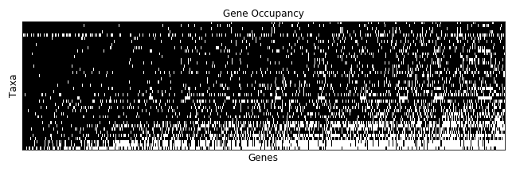
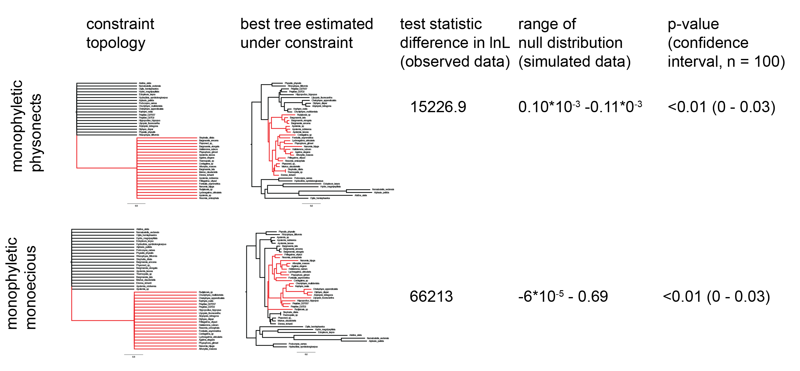

```{r preliminaries, include=FALSE}
	# Load packages

	# General
	library( tidyverse )
	library( stringr )
	library( forcats )
  library( magrittr )
	library( digest )
	library( knitr )
	library( jsonlite )
	library( parallel )

	# Formatting
  library( xtable )

	# Graphics
	library( cowplot )
	library( ggtree )
	library( fields ) # tim.colors
	library( seriation )
	library( gridExtra )
  library( factoextra )
  library( FactoMineR )

	# Biological
	library( hutan )	# https://github.com/caseywdunn/hutan
	library( ape )
	library( picante )  # cor.table
	library( phytools ) # phylosig
  library( vegan )
  library( ggtree )
  library( phangorn )
  library( geiger )
  library( phylobase )
  library( adephylo )
  library( geomorph ) #physig
  library( phylolm )

	# Configure knitr, see http://yihui.name/knitr/options
	opts_knit$set(
	  progress=TRUE,
	  verbose=TRUE)

	opts_chunk$set(
	#  include=FALSE,
	  cache=TRUE,
	  echo=FALSE,
	  message=FALSE
	 )

	# Set system computational parameters
	cores = detectCores() - 1
	if ( cores < 1 ) {
		cores = 1
	}
	set.seed( 23456 )

	# Set paths to input data
	tree_path = "agalma/Outfiles/"
	input_file_ml = paste( tree_path, "RAxML_bipartitions.alignment.fa", sep="" )
	input_file_bootstraps = paste( tree_path, "RAxML_bootstrap.alignment.fa", sep="" )

	input_files_phylobayes = list.files(
	  path=tree_path,
	  pattern="chain\\d+_trimmed60_poisson.treelist"
	 )
	
	#remove two chains that are stuck in local maxima
	input_files_phylobayes= input_files_phylobayes[-which(input_files_phylobayes %in% c("chain1_trimmed60_poisson.treelist","chain3_trimmed60_poisson.treelist"))]

	# Analysis parameters
	burn_in = 400

```

```{r functions}

  get_node_support = function(  tree, treeset, threshold=100 ){
    # Returns a vector corresponding to nodes in tree, with percent of trees
    # in treeset that contain the corresponding bipartition
    clades = prop.clades(tree, treeset) / length(treeset)
    clades[is.na(clades)]<-0
    nodes = c(rep(NA,length(tree$tip.label)), round(clades*100)) # Offset with NA values for tips
    nodes[ length(tree$tip.label) + 1 ] = NA # Set the root value to NA, not a robust way to find root but works in this case

    nodes[ nodes >= threshold  ] = NA

    return(nodes)
  }

  gsub2 <- function(pattern, replacement, x, ...) {
  for(i in 1:length(pattern))
  x <- gsub(pattern[i], replacement[i], x, ...)
  x
  }

  correctnames =read.csv("tipcorrection.csv") #updating species IDs relative to agalma species IDs

  fix_names = function( tree ){
    # Apply changes to any tip names
    tree$tip.label = sub( '_', ' ', tree$tip.label ) # Change first underscore to space
    tree$tip.label = sub( 'sp_', 'sp', tree$tip.label ) # Fix trailing _ in Physonect sp_
    tree$tip.label = gsub2(correctnames$Agalma.ID, correctnames$Tree.ID,tree$tip.label)
    return( tree )
  }

```


```{r load_data}

	species_tree = ape::read.tree( input_file_ml )
  species_tree = fix_names( species_tree )
  species_tree_unladder =species_tree

  bootstrap_trees = ape::read.tree( input_file_bootstraps )

  phylobayes_trees = sapply(
    input_files_phylobayes,
    function( pb ) {
      ape::read.tree(
        paste( tree_path, pb, sep = "" )
      )[ -(1:burn_in)  ]
    }
  )

  phylobayes_trees = unlist( phylobayes_trees,recursive=FALSE )
  class( phylobayes_trees  ) = "multiPhylo"

  bootstrap_trees = lapply( bootstrap_trees, fix_names )
  phylobayes_trees = lapply( phylobayes_trees, fix_names )


```

```{r pre_process_species_trees}

	species_tree = ape::ladderize( species_tree )

	species_tree =
	  ape::root(
	    species_tree,
	    c( "Nematostella vectensis", "Aiptasia pallida" ),
	    resolve.root=TRUE
	   )

  # Repartition length of edges descended from root so they are non-zero
	species_tree = hutan::slide_root_edges( species_tree )

	# species_tree = ape::unroot(species_tree)

	stopifnot( species_tree$Nnode == length( species_tree$node.label ) )


	# Make ultrametric tree
	# By default, root has a depth of 1
	species_ultrametric = chronos( species_tree, lambda=1, model="correlated", quiet=TRUE )
	class( species_ultrametric ) = "phylo"

```


# Improved phylogenetic resolution within Siphonophora (Cnidaria) with implications for trait evolution {-}


Catriona Munro^1^\*^,^‡, Stefan Siebert^1,2^\*, Felipe Zapata^3^, Mark Howison^4,5^, Alejandro Damian Serrano^1,10^, Samuel H. Church^1,6^, Freya E. Goetz^1,7^, Philip R. Pugh^8^, Steven H.D. Haddock^9^, Casey W. Dunn^10^


^1^ Department of Ecology and Evolutionary Biology, Brown University, Providence, RI 02912, USA

^2^ Current address: Department of Molecular & Cellular Biology, University of California Davis, Davis, CA 95616, USA

^3^ Department of Ecology and Evolutionary Biology, University of California Los Angeles, Los Angeles, CA 90095, USA

^4^ Brown Data Science Practice, Brown University, Brown University, Providence, RI 02912, USA

^5^ Current address: Watson Institute for International and Public Affairs, Brown University, Providence, RI 02912, USA

^6^ Current address: Department of Organismic and Evolutionary Biology, Harvard University, Cambridge, MA 02138, USA

^7^ Current address: Smithsonian Institution, National Museum of Natural History, Washington, DC 20560, USA

^8^ National Oceanography Centre, Southampton, SO14 3ZH, UK

^9^ Monterey Bay Aquarium Research Institute, Moss Landing, CA 95039, USA

^10^ Department of Ecology and Evolutionary Biology, Yale University, New Haven, CT 06520, USA

\* Authors contributed equally

\‡ Corresponding author, catriona_munro@brown.edu

## Abstract {-}

Siphonophores are a diverse group of hydrozoans (Cnidaria) that are found at most depths of the ocean - from the surface, like the familiar Portuguese man of war, to the deep sea. They play important roles in ocean ecosystems, and are among the most abundant gelatinous predators. A previous phylogenetic study based on two ribosomal RNA genes provided insight into the internal relationships between major siphonophore groups, however there was little support for many deep relationships within the clade Codonophora. Here, we present a new siphonophore phylogeny based on new transcriptome data from 29 siphonophore species analyzed in combination with 14 publicly available genomic and transcriptomic datasets. We use this new phylogeny to reconstruct several traits that are central to siphonophore biology, including sexual system (monoecy vs. dioecy), gain and loss of zooid types, life history traits, and habitat. The phylogenetic relationships in this study are largely consistent with the previous phylogeny, but we find strong support for new clades within Codonophora that were previously unresolved. These results have important implications for trait evolution within Siphonophora, including favoring the hypothesis that monoecy arose at least twice.

## 1. Introduction {-}

Siphonophores (Fig. \@ref(siphonophores) and \@ref(colony)) are among the most abundant gelatinous predators in the open ocean, and have a large impact on ocean ecosystems [@pugh1984diel;@pugh1997vertical; @williams1981vertical; @purcell1981dietary; @pages2001gelatinous;  @Choy20172116]. Siphonophores, which belong to Hydrozoa (Cnidaria), are found at most depths in the ocean, with the deepest recorded species found around 4300m [@lindsay2005planktonic]. The most familiar species is the Portuguese man of war *Physalia physalis*, which floats at the surface and can wash up conspicuously onto beaches [@Totton1960]. Most species are planktonic, living in the water column, where some grow to be more than 30 meters in length [@mackie1987siphonophore]. There is also a small clade of benthic siphonophores, Rhodaliidae, that are tethered to the bottom for part of their lives [@pugh1983benthic]. There are currently 187 valid described siphonophore species [@worms].

Siphonophores remain poorly known, in large part because they are fragile and difficult to collect. They have, however, been of great interest for more than 150 years due to their unique structure and development [@mapstone2014global;@mackie1987siphonophore]. Like many other cnidarians, they are colonial: they grow by incomplete asexual reproduction. Each colony arises from a single embryo that forms the protozooid, the first body. One or two growth zones (Fig. \@ref(colony)) then arise and asexually produce other genetically identical zooids that remain attached [@carre1969etude; @carre1991complete; @carre1967; @carre1993ordre]. These zooids are each homologous to a solitary animal, but are physiologically integrated [@totton1965synopsis; @mackie1987siphonophore; @dunn2006evolution]. Siphonophores differ significantly from other colonial animals in their colony structure and development -- their zooids are highly functionally specialized and arranged in precise, repeating, species-specific patterns [@Beklemishev1969;@cartwright2010character]. Zooids are specialized for a range of functions, including feeding, reproduction, or swimming (Fig. \@ref(colony)) [@dunn2006evolution].

![\label{siphonophores}Photographs of living siphonophores. Colored circles correspond to the clades shown in Figure 3 as follows: Cystonectae (A-B), Calycophorae (C-G), Apolemiidae (H), and Clade A within Euphysonectae (I-K). (A) *Rhizophysa eysenhardtii*, scale bar = 1 cm. (B) *Bathyphysa conifera*, scale bar = 2cm. (C) *Hippopodius hippopus*, scale bar = 5 mm. (D) *Kephyes hiulcus*, scale bar = 2 mm. (E) *Desmophyes haematogaster*, scale bar = 5 mm. (F) *Sphaeronectes christiansonae*, scale bar = 2 mm. (G) *Praya dubia*, scale bar = 4 cm . (H) *Apolemia* sp., scale bar = 1 cm. (I) *Lychnagalma utricularia*, scale bar = 1 cm.  (J) *Nanomia* sp., scale bar = 1 cm. (K) *Physophora hydrostatica*, scale bar = 5 mm. Photo credits: S. Siebert (C,H,I,K), S. Haddock (A,D,E,F), R. Sherlock (B), MBARI (G), C. Munro (J)](figures/Figure1.jpg)

Understanding the unique ecology, morphology, and development of siphonophores requires a well-resolved phylogeny of the group. The relationship of siphonophores to other hydrozoans has been difficult to determine [@cartwright2010character; @Cartwright2008kl; @zapata2015phylogenomic; @kayal2015phylogenetic], but there has been progress on their internal relationships. A phylogeny [@Dunn:2005dy] based on two genes (16S, 18S) from 52 siphonophore taxa addressed several long standing questions about siphonophore biology, including the relationships of the three historically recognised groups, Cystonectae, Physonectae, and Calycophorae. Cystonectae was found to be sister to all other siphonophores, while Calycophorae were nested within "Physonectae". The name Codonophora was given to this clade of "Physonectae" and Calycophorae [@Dunn:2005dy].

Major questions remained after this early work, though. In particular, there was little support for important deep relationships within Codonophora. Understanding these relationships is key to resolving the evolution of several traits of importance, including sexual systems (monoecy versus dioecy) and the gain and loss of particular zooids, such as palpons (Fig. \@ref(colony)). Here we present a broadly sampled phylogenetic analysis of Siphonophora that considers transcriptomic data from 33 siphonophore species and 10 outgroup species (2 outgroups were subsequently excluded due to poor sampling). Using 1,423 genes, we find strong support for many relationships found in the earlier phylogeny [@Dunn:2005dy], and also provide new resolution for key relationships that were unresolved in that previous study. Using this phylogeny, we reconstruct the evolutionary history of characters central to the unique biology of siphonophores, including zooid type, life history traits, and habitat.

![\label{colony}Schematic of the siphonophore *Nanomia bijuga*, oriented with the anterior of the colony at the top of the page, and the ventral side to the left. Adapted from http://commons.wikimedia.org/wiki/File:Nanomia_bijuga_whole_animal_and_growth_zones.svg, drawn by Freya Goetz. (A) Overview of the whole mature colony. (B) Inset of the pneumatophore and nectosomal growth zone. A series of buds give rise to nectophores. (C) Inset of the siphosomal growth zone. Probuds subdivide to give rise to zooids in repeating units (cormidia). The gastrozooid (specialized feeding polyp) is the posterior-most zooid within each cormidium.](figures/Figure2.pdf)


## 2. Material and methods {-}

All scripts for the analyses are available in a git repository at [https://github.com/caseywdunn/siphonophore_phylogeny_2017](https://github.com/caseywdunn/siphonophore_phylogeny_2017). The most recent commit at the time of the analysis presented here was `r system("git log | head -n 1", intern=TRUE) %>% str_replace("commit ", "")` with tag "paper_v1".


### 2.1 Collecting{-}

Specimens were collected in the north-eastern Pacific Ocean, Mediterranean, and the Gulf of California (see table 1). Collection data on all examined specimens, a description of the tissue that was sampled from the colony, collection mode, sample processing details, mRNA extraction methods, sequencing library preparation methods, and sequencing details are summarized in the file Supplementary data 1 (also found in the git repository). Monterey Bay and Gulf of California specimens were collected by remotely operated underwater vehicle (ROV) or during blue-water SCUBA dives. *Chelophyes appendiculata* and *Hippopodius hippopus* (Fig. \@ref(siphonophores)C) specimens were collected in the bay of Villefranche-sur-Mer, France, during a plankton trawl on 13 April 2011. Available physical vouchers have been deposited at the Museum of Comparative Zoology (Harvard University), Cambridge, MA, the Peabody Museum of Natural History (Yale University), New Haven, CT, or had been previously deposited at the Smithsonian National Museum of Natural History, Washington, DC. Accession numbers are given in Supplementary data 1. In cases where physical vouchers were unavailable we provide photographs to document species identity (see git repository: https://github.com/caseywdunn/siphonophore_phylogeny_2017/tree/master/supplementary_info/photographic_vouchers).

### 2.2 Sequencing{-}

When possible, specimens were starved overnight in filtered seawater at temperatures close to ambient water temperatures at the time of specimen collection. Subsequently, mRNA was extracted directly from tissue using a variety of methods (Supplementary data 1): Magnetic mRNA Isolation Kit (NEB, #S1550S), Invitrogen Dynabeads mRNA Direct Kit (Ambion, #61011), Zymo Quick RNA MicroPrep (Zymo #R1050), or from total RNA after Trizol (Ambion, #15596026) extraction and through purification using Dynabeads mRNA Purification Kit (Ambion, #61006).  In case of small total RNA quantities, only a single round of bead purification was performed. Extractions were performed according to the manufacturer's instruction. All samples were DNase treated (TURBO DNA-free, Invitrogen #AM1907; or on column DNase treatment with Zymo Quick RNA MicroPrep). Libraries were prepared for sequencing using the Illumina TruSeq RNA Sample Prep Kit (Illumina, #FC-122-1001, #FC-122-1002), the Illumina TruSeq Stranded Library Prep Kit (Illumina, #RS-122-2101) or the NEBNext RNA Sample Prep Master Mix Set (NEB, #E6110S). We collected long read paired end Illumina data for *de novo* transcriptome assembly. In the case of large tissue inputs, libraries were sequenced separately for each tissue, subsequently subsampled and pooled *in silico*. Libraries were sequenced on the HiSeq 2000, 2500, and 3000 sequencing platforms. Summary statistics for each library are given in the file Supplementary data 2. All sequence data have been deposited in the NCBI sequence read archive (SRA) with Bioproject accession number PRJNA255132.

### 2.3 Analysis{-}

New data were analysed in conjunction with 14 publicly available datasets [@zapata2015phylogenomic; @Dunn:2013kw; @lehnert2012developing; @philippe2009phylogenomics; @fidler2014unique; @chapman2010dynamic; @sanders2014differential; @putnam2007sea; @sanders2015interspecific], with a total number of 43 species. Sequence assembly, annotation, homology evaluation, gene tree construction, parsing of genes trees to isolate orthologous sequences, and supermatrix construction were conducted with Agalma (commit 6bd9988, running BioLite commit 784edc6) [@Dunn:2013kw; @Guang202416].  This workflow integrates a variety of existing tools [@grabherr2011full; @altschul1990basic; @doi:10.1093/nar/30.7.1575; @sukumaran2010dendropy; @langmead2012fast; @li2011rsem; @talavera2007improvement; @li2009sequence; @katoh2013mafft] and new methods. Maximum likelihood (ML) analyses of the supermatrix were conducted with RAxML v 8.2.0 [@stamatakis2006raxml] and implemented via Agalma. Bayesian Inference (BI) analyses of the supermatrix were conducted using Phylobayes v. 1.7a-mpi [@lartillot2009phylobayes]. Sequence alignments, sampled and consensus trees, and voucher information are available in the git repository. Tree figures were rendered with ggtree [@Yu:2016fo].

Two outgroup species, *Atolla vanhoeffeni* and *Aegina citrea*, were removed from the final supermatrix due to low gene occupancy (gene sampling of 17.0% and 17.3% respectively in a 60% occupancy matrix with 3,379 genes). The final analyses presented here consider 33 siphonophore species and 8 outgroup species. This includes new data for 30 species. In the final analyses, we sampled 1,423 genes to generate a supermatrix with 80% occupancy and a length of 395,699 amino acids (Fig. \@ref(gene-occupancy)).

ML analyses were conducted on the unpartitioned supermatrix using the WAG+$\Gamma$ model of amino acid substitution, and bootstrap values were estimated using `r length(bootstrap_trees)` replicates. BI was conducted using two different CAT models, CAT-Poisson and CAT-GTR [@doi:10.1093/molbev/msh112]. Two independent MCMC chains were run under the CAT-GTR model, and eight independent MCMC chains were run under the CAT-Poisson model. The BI analyses did not converge (CAT-Poisson: maxdiff=1, meandiff=0.0185032; CAT-GTR: maxdiff=1, meandiff=0.045415). Only the results from the CAT-Poisson model are presented here. Two chains (chain1 and chain3) were stuck in local maxima after 1405 and 4695 iterations and were excluded from the analyses. Visual inspection of the traces indicated that a burn in of `r burn_in` trees was sufficient for all CAT-Poisson runs. This left `r length( phylobayes_trees )` trees in the posterior.

To test the robustness of the results to model selection, we also used IQTree to implement other ML analyses using different models of substitution [@doi:10.1093/molbev/msu300; @doi:10.1093/molbev/msx281].  We also evaluated effects of method (ML vs. BI), model, and program by running a fixed-state WAG+$\Gamma$ model in Phylobayes and an ML approximation of CAT models in IQTree.

We used the Swofford-Olsen-Waddell-Hillis (SOWH) test [@swofford1996phylogenetic] to evaluate two hypotheses (Fig. \@ref(phylogeny)C, S2): (i) "Physonectae" is monophyletic [@totton1965synopsis]; (ii) monoecious species are monophyletic [@Dunn:2005dy]. As the sexual system of *Rudjakovia* sp. is unclear, we carried out two tests of the monophyly of monoecy, one with *Rudjakovia* sp. included as a monoecious species, and one with it considered dioecious (Fig. \@ref(phylogeny)C, S2). We used SOWHAT [@doi:10.1093/sysbio/syv055] dev. version 0.39 (commit fd68ef57) to carry out the SOWH tests in parallel, using the default options and an initial sample size of 100 (analysis code can be found in the git repository). For each hypothesis we defined a topology with a single constrained node that was inconsistent with the most likely topology (Fig. \@ref(phylogeny)). We used a threshold for significance of 0.05 and following the initial 100 samples, we evaluated the confidence interval around the p-value to determine if more samples were necessary.  

Morphological character data used in trait mapping were obtained from the literature or direct observation of available voucher material. Depth distribution data was queried from the MBARI VARS database ( http://www.mbari.org/products/research-software/video-annotation-and-reference-system-vars/) [@schlining2006mbari]. We used stochastic character mapping to infer the probable evolution of traits on the tree in R using the `phytools` package [@MEE3:MEE3169; @huelsenbeck2003stochastic]. Subsequent analyses were conducted in R and integrated into this manuscript with the `knitr` package. See Supplementary Information for R package version numbers.

## 3. Results and Discussion{-}

### 3.1 Species phylogeny and hypothesis testing{-}

```{r specimen_summary, results='asis', echo=FALSE, comment=NA, warning=FALSE}
specimen_data <- read.csv("supplementary_info/Supplementary_data_1_Specimen_data.csv")
names(specimen_data)<-c("New data","Species","ID","SRA Number", "Library ID", "Library type","Tissue","Sequencer", "Sequencing center", "Sample prep","Collected by","Identified by","Collection date","Specimen id","Depth (m)","Geo loc name","Lat Lon","Voucher Type","Voucher location","Voucher Cat No.","Collection mode")

specimen_data_reduced <- specimen_data[,c(1,2,15,17,4)]
specimen_data_reduced$`New data`<-sub("^N"," ",specimen_data_reduced$`New data`)

specimen_data_reduced<-as.data.frame(specimen_data_reduced)
xtable_specimen<-xtable(specimen_data_reduced,auto=TRUE, caption="A complete list of specimens used in this work, information from already published datasets added where available. New data indicated by Y, blank fields indicate that data were already published. For the species not on SRA, a link to the data is included in supplementary file 1.")
print(xtable_specimen,comment=F, include.rownames=FALSE, scalebox='0.7')

```

```{r species_phylogram, verbose= FALSE, include=F, message = FALSE, echo=FALSE, comment=NA, warning=FALSE }

	siphonophora_node = ape::mrca( species_tree )[ "Physalia physalis", "Agalma elegans" ]
	cystonectae_node = ape::mrca( species_tree )[ "Physalia physalis", "Rhizophysa filiformis" ]
	calycophora_node = ape::mrca( species_tree )[ "Kephyes ovata", "Hippopodius hippopus" ]
	euphysonectae_node = ape::mrca( species_tree )[ "Agalma elegans", "Erenna richardi" ]

	support = as.numeric( species_tree$node.label )
	support[ support > 99 ] = NA

	# pad tip values
	support = c( rep( NA, length( species_tree$tip.label ) ), support )

	p_phylogram = ggtree( species_tree ) +
			# geom_text( aes( label=support ), vjust=-.5, hjust=1, size=2.5, col="darkslategray4" ) +
	    geom_text(aes(label=get_node_support(species_tree, bootstrap_trees)), vjust=-.5, hjust=1, size=2.5, col="red") +
      geom_text(aes(label=get_node_support(species_tree, phylobayes_trees)), vjust=1.5, hjust=1, size=2.5, col="blue") +
			geom_tiplab( size=3 ) +
			xlim( NA, 4 ) +
			geom_cladelabel( node=cystonectae_node, label="Cystonectae", align=FALSE, offset=1, color='red' ) +
			geom_cladelabel( node=calycophora_node, label="Calycophora", align=FALSE, offset=1, color='blue' ) +
			geom_strip(
				which( species_tree$tip.label=="Agalma elegans" ),
				which( species_tree$tip.label=="Apolemia white" ),
				barsize=0.5,
				color='orange',
				offset=1,
				label='"Physonectae"'
			) +
			geom_strip(
				which( species_tree$tip.label=="Hydractinia symbiolongicarpus" ),
				which( species_tree$tip.label=="Nematostella vectensis" ),
				barsize=0.5,
				color='gray',
				offset=1,
				label='"Outgroups"'
			)

pdf("figures_raw/figure_3_raw.pdf")
flip( p_phylogram, euphysonectae_node, calycophora_node )
dev.off()

```

The phylogenetic relationships recovered in this study received strong support across analysis methods (Fig. \@ref(phylogeny)A), with a couple of localized exceptions (Fig. \@ref(phylogeny)B and \@ref(bayesian)). The ML results were robust to model selection (Fig. \@ref(fig:supplementary-trees)). BI results were not robust to model selection: BI CAT models produced strongly supported topologies that differed from the ML topology (Fig. \@ref(phylogeny)B and \@ref(bayesian)), while the BI WAG+$\Gamma$ topology was consistent with the ML topology (Fig. \@ref(fig:BI-WAG)). Most clades are consistent with those found in a previous study based on two genes (16S and 18S ribosomal RNA) [@Dunn:2005dy]. Relationships that receive strong support in both include the placement of Cystonectae as sister to Codonophora (the clade that includes all other siphonophores), the placement of Apolemiidae as sister to all other codonophorans, and the placement of Calycophorae within the paraphyletic "Physonectae". Multiple nodes that were not resolved in the previous two-gene analysis receive strong support in the present 1,423-gene transcriptome analyses. There is strong support for Pyrostephidae as sister to all other non-apolemiid codonophorans. We provisionally refer here to Pyrostephidae as the clade including *Rudjakovia* sp., although sampling of *Pyrostephos vanhoeffeni* is needed in order to determine if *Rudjakovia* sp. falls within Pyrostephidae or is sister to it. Within the clade that is sister to Pyrostephidae, we find two main clades, Calycophorae and a clade we here name Euphysonectae (Fig. \@ref(phylogeny)A). It includes the remaining non-apolemiid, non-pyrostephid "Physonectae". We define Euphysonectae as the clade consisting of *Agalma elegans* and all taxa that are more closely related to it than to *Diphyes dispar*.

In ML analyses Euphysonectae consists of two reciprocally monophyletic groups that we here provisionally refer to as Clade A and Group B (Fig. \@ref(phylogeny)A). In BI CAT-Poisson analyses, Group B is graded (Fig. \@ref(phylogeny)B). The presence of an involucrum, a fold around the base of the cnidoband [@totton1965synopsis], is a potential synapomorphy for Clade A. Species of Clade A also have a descending mantle canal within the nectophores (Fig. \@ref(fig:desc-mantle), \@ref(fig:mantle-BI)), a structure that is also present in some calycophorans. Members of Clade A are also monoecious (Fig. \@ref(reconstruct)). There is not a clear synapomorphy for Group B. Within Group B there is high support for the placement of *Erenna richardi* in ML analyses, but it is placed as sister to Clade A in BI CAT-Poisson analyses (Fig. \@ref(phylogeny)B). More taxon sampling will be required to determine the relationship of species within this clade.

Within Clade A, *Physophora gilmeri* along with *Lychnagalma utricularia* (Fig. \@ref(siphonophores)I) (both not included in the previous phylogeny) are sister to Agalmatidae, a clade restricted to *Agalma*, *Athorybia*, *Melophysa*, *Halistemma* and *Nanomia* [@Dunn:2005dy; @pugh2006taxonomic]. In the rDNA study, *P. hydrostatica* (the presumed sister species to *P. gilmeri*) was sister to Forskaliidae with low support. The position of *Cordagalma cordiforme* (= *C. ordinatum*) [@pugh2016synopsis] was previously unresolved, while in this analysis *Cordagalma* sp. is in a clade with *Forskalia asymmetrica*, falling outside of Agalmatidae. Placement of *Cordagalma* outside Agalmatidae is consistent with previous analyses of molecular and morphological data [@pugh2006taxonomic; @Dunn:2005dy].

Within Calycophorae, taxon sampling is less comprehensive here than in the previous study. The calycophoran relationships that can be investigated, however, are in broad agreement with the previous analysis. Calycophorans have in the past been split into two groups, prayomorphs and diphyomorphs, based on morphology after @mackie1987siphonophore. As in the previous study, the results presented here indicate that the prayomorphs are paraphyletic with respect to the diphyomorphs. In the previous study, the relationship between *C. lathetica* and the clade including *H. hippopus* was unresolved. In this study, *Craseoa lathetica* and *Desmophyes* sp. are sister to *Hippopodius hippopus* in ML analyses with high support, while in BI CAT-Poisson analyses, *H. hippopus* is sister to *Lilyopsis fluoracantha* and the diphyomorphs (Fig. \@ref(phylogeny)B).

![\label{phylogeny}(A) Maximum likelihood (ML) phylogram with bipartition frequencies from the ML bootstraps and the Bayesian posterior distribution of trees. Unlabeled nodes have support >0.99 for both bootstraps and posteriors. The numbers of valid described species estimated to be in each clade based on taxonomy are shown below each clade name on the right. (B) The topologies found in the posterior distribution of trees that conflict with the ML tree. (C) The topologies evaluated by the SOWH tests. For more details on the SOWH topologies refer to Fig. \@ref(sowh).](figures/Figure3.pdf)

Using the Swofford-Olsen-Waddell-Hillis (SOWH) test [@swofford1996phylogenetic], we evaluated the following two alternative phylogenetic hypotheses against the most likely tree topology (Fig. \@ref(phylogeny)C): (i) monophyletic Physonectae, (ii) monophyletic monoecious siphonophores. As the sexual mode of  *Rudjakovia* is undescribed, we carried out two tests: with one test including *Rudjakovia* sp. as a monoecious species, and the other with dioecious *Rudjakovia* sp. In all three tests the alternative hypothesis was rejected (p-value <0.01, confidence interval: <0.001 - 0.03, Fig. \@ref(sowh)).

The broad taxon sampling and more extensive gene sampling of this phylogeny provide new evidence for the relationships between major siphonophore clades within Codonophora, specifically between Pyrostephidae, Calycophorae, and the newly named Euphysonectae. This opens up new questions about key relationships within both Calycophorae and Euphysonectae -- where future transcriptome sampling efforts should be focused. Within Euphysonectae, two clades (Clade A and Group B) are hypothesized, although there is weaker support for Group B (Fig. \@ref(phylogeny)A, 3B). Expanding sampling of species that probably fall in Group B, including other *Erenna* species, rhodaliids, and relatives of Undescribed sp L, will greatly expand our understanding of these two groups and perhaps provide evidence of Group B synapomorphies. Similarly, within Calycophorae, increased taxon sampling is needed. This study, and the previous phylogenetic study [@Dunn:2005dy], suggest that the prayomorphs are paraphyletic, but for slightly different reasons given the different sampling of the analyses. In @Dunn:2005dy, a clade of prayomorphs including *Praya dubia* (Fig. \@ref(siphonophores)G), *Nectadamas diomedeae*, and *Nectopyramis natans* (not included in this study) were found to be sister to all other calycophorans, while in this study, the prayomorph *Lilyopsis fluoracantha* (not included in the previous study) is found in a clade including diphyomorph calycophorans that is sister to all other prayomorphs. Expanded transcriptome sequencing, particularly *P. dubia* or a nectopyramid, but also extensive sampling across the major prayomorph and diphyomorph groups, will expand our understanding of relationships within Calycophorae. This will be especially important for understanding trait evolution within Calycophorae,  for example, the release of eudoxids (Fig. \@ref(traitdist)), or the arrangement of male and female zooids along the stem (see section 3.2 below).

```{r char_evo_setup, include=F, echo=FALSE}
#Load data
read.csv('character_coding/main_characters.csv', header = T, sep = ',') -> cdata
rownames(cdata) = cdata$Species

#Load tree
tree = species_tree_unladder
tree <- drop.tip(tree, which(!(tree$tip.label %in% rownames(cdata))))
#tree<-rotateNodes(tree,nodes=c(28,31))

ultratree <- chronos(tree)
class( ultratree ) = "phylo"
nodes_to_rotate = c(ape::mrca(ultratree)["Physalia physalis","Kephyes ovata"], ape::mrca(ultratree)["Bargmannia lata","Hippopodius hippopus"])
ultratree<-rotateNodes(ultratree,nodes=nodes_to_rotate)

#Temporarily prune data
cdata %<>% filter(rownames(.) %in% tree$tip.label)
rownames(cdata) = cdata$Species
cdata %<>% .[-1]

#Named vectors for variables
sex = cdata$Sex
names(sex) = rownames(cdata)
sex[which(names(sex)=="Rudjakovia sp")] <- "Dioecious" #Modified for graphing purposes

nectosome = cdata$Nectosome
names(nectosome) = rownames(cdata)

palpons = cdata$Palpons
names(palpons) = rownames(cdata)

tentilla = cdata$Tentilla
names(tentilla) = rownames(cdata)

tentilla2 = tentilla
tentilla2['Physalia physalis'] = 1 #In the scenario where we consider Physalias knobs reduced not lost tentilla

bracts = cdata$Bract.types
bracts[which(bracts>0)] <- 1  #bracts changed to presence absence for tip annotation
names(bracts) = rownames(cdata)
cdata$Bract.types = bracts
names(cdata)[8] = "Bracts"

#Depth pruned data
dpruned_data = cdata[which(!is.na(cdata$Depth.Median)), ]
dpruned_tree <- drop.tip(ultratree, which(!(ultratree$tip.label %in% rownames(dpruned_data))))
dpruned_data <- dpruned_data[match(dpruned_tree$tip.label, rownames(dpruned_data)),]

depth_median = dpruned_data$Depth.Median
names(depth_median) = rownames(dpruned_data)
```

```{r simmap_making, echo=FALSE, message=FALSE, warning=FALSE, include=F}
#Stochastic trait mapping:
#Make simmap objects
#print("SIMMAP Sex Distribution")
make.simmap(ultratree, sex, nsim = 100, message=FALSE) -> sex_sim
#print("SIMMAP Palpons")
make.simmap(ultratree, palpons, nsim = 100, message=FALSE) -> palpons_sim
#print("SIMMAP Tentilla")
make.simmap(ultratree, tentilla, nsim = 100, message=FALSE) -> tentilla_sim
#print("SIMMAP Tentilla2")
make.simmap(ultratree, tentilla2, nsim = 100, message=FALSE) -> tentilla_sim2
#print("SIMMAP Nectosome")
make.simmap(ultratree, nectosome, nsim = 100, message=FALSE) -> nectosome_sim
#print("SIMMAP Nectosome Position")
make.simmap(ultratree, bracts, nsim = 100, message=FALSE) -> bracts_sim
#print("SIMMAP Habitat")

#Nectophore position SIMMAP setup
necto_pos_data = cdata[which(cdata$Nectosome.position != "None"),]
necto_pos = necto_pos_data$Nectosome.position
names(necto_pos) = rownames(necto_pos_data)
NectoPosTree = drop.tip(ultratree, which(!(ultratree$tip.label %in% names(necto_pos))))
make.simmap(NectoPosTree, necto_pos, nsim = 100, message=FALSE) -> necto_pos_sim

#Descending mantle Canal SIMMAP Setup
desc_mantle_data = cdata[which(!is.na(cdata$Desc.Mantle.Canal)),]
desc_mantle = desc_mantle_data$Desc.Mantle.Canal
names(desc_mantle)=rownames(desc_mantle_data)
desc_mantle[which(names(desc_mantle)=="Rudjakovia sp")] <- 0 #Modified for graphing purposes
DescMantleTree =  drop.tip(ultratree, which(!(ultratree$tip.label %in% names(desc_mantle))))
make.simmap(DescMantleTree, desc_mantle, nsim = 100, message=FALSE) -> desc_mantle_sim
```

```{r sex, echo=FALSE, message=F, warning=FALSE, include=F}
par(ask=F)
#Simmap SEX
plotTree(ultratree, lwd = 4)
colors = c("black", "red")
names(colors) = c("Dioecious", "Monoecious")
sex_sim %>% plotSimmap(lwd = 4, add = T, colors=colors)
nodelabels(pie=(describe.simmap(sex_sim, plot=F)$ace) ,piecol=colors,cex=0.35)
add.simmap.legend(colors = colors, x=0.6*par()$usr[1],y=0.3*par()$usr[4],prompt=FALSE)
sex_obj <- densityMap(sex_sim, plot=FALSE)
sex_obj$cols[1:length(sex_obj$cols)]<-colorRampPalette(colors=c("#4A4ACC", "orange"), space="Lab")(length(sex_obj$cols))
 pdf("figures_raw/figure_5_raw_sex.pdf")
 plot(sex_obj)
 dev.off()
```

```{r palpons, echo=FALSE, message=F, warning=FALSE, include=F}
#Simmap PALPONS

##MODEL test
fitDiscrete(ultratree, palpons, model="ER")$opt$aicc #24.85
fitDiscrete(ultratree, palpons, model="ARD")$opt$aicc #24.60

 plotTree(ultratree, lwd = 4)
 colors = c("black", "red")
 names(colors) = c("Absent", "Present")
 palpons_sim %>% plotSimmap(lwd = 4, add = T,colors=colors)
 nodelabels(pie=(describe.simmap(palpons_sim, plot=F)$ace) ,piecol=colors,cex=0.35)
 add.simmap.legend(colors = colors, x=0.6*par()$usr[1],y=0.3*par()$usr[4],prompt=FALSE)
palpons_obj <- densityMap(palpons_sim, plot=FALSE)
palpons_obj$cols[1:length(palpons_obj$cols)]<-colorRampPalette(colors=c("#4A4ACC", "orange"), space="Lab")(length(palpons_obj$cols))
 pdf("figures_raw/figure_5_raw_palpons.pdf")
 plot(palpons_obj)
 dev.off()
```

```{r vars_plot, echo=FALSE, message=F, warning=FALSE, include=F}
#Get Raw Data
raw_data = read.csv(file="character_coding/trim_siphdepths.tsv", sep = "\t")[,c(4,3,5:11)]
raw_data = raw_data[order(raw_data$ConceptName),]

#Clean Raw Data
names(raw_data)[1] = "Species"
raw_data$Species = as.character(raw_data$Species)
raw_data$Species[which(raw_data$Species == "Kephyes")] = "Kephyes ovata"
raw_data$Species[which(raw_data$Species == "Lilyopsis")] = "Lilyopsis fluoracantha"
raw_data$Species[which(raw_data$Species == "Agalma")] = "Agalma elegans"
raw_data$Species[which(raw_data$Species == "Frillagalma")] = "Frillagalma vityazi"
raw_data$Species[which(raw_data$Species == "Stephalia")] = "Stephalia dilata"
raw_data$Species[which(raw_data$Species == "Lychnagalma")] = "Lychnagalma utricularia"
raw_data$Species[which(raw_data$Species == "Craseoa")] = "Craseoa lathetica"
raw_data$Species[which(raw_data$Species == "Cordagalma")] = "Cordagalma sp"
raw_data$Species[which(raw_data$Species == "Desmophyes haematogaster")] = "Desmophyes sp"
raw_data$Species[which(raw_data$Species == "Rudjakovia")] = "Rudjakovia sp"
raw_data$Species[which(raw_data$Species == "Physonectae sp. 1")] = "Undescribed sp L"

#Adjust Data to tree structure
raw_data[which(raw_data$Species %in% ultratree$tip.label),] -> intree_data
tree$tip.label[which(!(ultratree$tip.label %in% raw_data$Species))] %>% length() -> missSPP
missing_data_proxy <- raw_data[1:missSPP,]
missing_data_proxy$Species = ultratree$tip.label[which(!(ultratree$tip.label %in% raw_data$Species))]
missing_data_proxy$Depth = rep(20, missSPP)
parched_data <- rbind(missing_data_proxy, raw_data[which(raw_data$Species %in% ultratree$tip.label),])
parched_data = parched_data[which(!is.na(parched_data$Depth)),]
parched_data$Species <- factor(parched_data$Species, levels = ultratree$tip.label)

#90% Cut-off of extrame values
SPDepths = parched_data[,1:2]
byspp_SPD = split(SPDepths, SPDepths$Species)
for(i in 1:length(byspp_SPD)){
  if(nrow(byspp_SPD[[i]])>200){
#   byspp_SPD[[i]] = sample_n(byspp_SPD[[i]], 0.02*nrow(byspp_SPD[[i]]))
    byspp_SPD[[i]] = sample_n(byspp_SPD[[i]], 200)
  }
}
trimmed_SDdata = bind_rows(byspp_SPD)

sp_order = c("Agalma elegans", "Athorybia rosacea", "Halistemma rubrum", "Nanomia bijuga", "Lychnagalma utricularia", "Physophora gilmeri", "Forskalia asymmetrica", "Cordagalma sp.", "Resomia ornicephala", "Frillagalma vityazi", "Undescribed Sp. L", "Marrus claudanielis", "Stephalia dilata", "Stephalia sp.", "Erenna richardi", "Abylopsis tetragona", "Diphyes dispar", "Chelophyes appendiculata", "Kephyes ovata", "Chuniphyes multidentata", "Lilyopsis fluoracantha", "Craseoa lathetica", "Desmophyes sp.", "Hippopodius hippopus", "Bargmannia amoena", "Bargmannia elongata", "Bargmannia lata", "Rudjakovia sp", "Apolemia rubriversa", "Apolemia lanosa", "Apolemia sp.", "Rhizophysa filiformis", "Physalia physalis")

trimmed_SDdata$Species = as.character(trimmed_SDdata$Species)
trimmed_SDdata = trimmed_SDdata[which(!is.na(trimmed_SDdata$Species)),]
trimmed_SDdata$Species <- factor(trimmed_SDdata$Species, levels = sp_order)

#ggplot(trimmed_SDdata, aes(x = Species, y=-Depth)) + geom_boxplot() + theme_classic()

 pdf("figures_raw/figure_4_raw_violin.pdf")
 ggplot(trimmed_SDdata, aes(x = Species, y=-Depth)) + geom_violin() + theme_classic()
 dev.off()
```

```{r ggtree_bin_heatmap, echo=FALSE, message=F, warning=FALSE, include=F}
p <- ggtree(ultratree)
p <- p + geom_tiplab(size=2.2)
f_cdata = sapply(cdata, as.factor) %>% as.data.frame %>% .[c(1,2,5:9,17,18,3)]
rownames(f_cdata) = rownames(cdata)
f_cdata = f_cdata[,c(7,4,1,3,6,2,10,8,9,5)]
f_cdata[match(tree$tip.label,rownames(f_cdata)),]

 pdf("figures_raw/figure_4_raw_heat.pdf")
 gheatmap(p, f_cdata, offset = 0.4, width=0.5, colnames_position = 'top', font.size = 1)
 dev.off()
```

### 3.2 Evolution of Monoecy {-}

In all siphonophores, each gonophore (sexual medusa that produces gametes) is either male or female. Within each siphonophore species, colonies are either monoecious (male and female gonophores are on the same colony) or dioecious (male and female gonophores are on different colonies). Previous analysis suggested that the common ancestor of siphonophores was dioecious, and was consistent with a single gain of monoecy within Codonophora and no secondary losses [@Dunn:2005dy]. The better-resolved tree in the current analyses indicates that the evolution of monoecy is more complicated than this. The two clades of monoecious siphonophores, Calycophorae and Clade A (Fig. \@ref(phylogeny)A), do not form a monophyletic group. This is because Group B, which contains dioecious species, is also descended from their most recent common ancestor. SOWH tests strongly reject the placement of the monecious clades Calycophorae and Clade A as a group that excludes Group B (Figs. 3C and S2). The positions of the only two taxa from Group B that were included in the previous analysis [@Dunn:2005dy], *Erenna* and *Stephalia*, were unresolved in that study. This difference in conclusions regarding trait evolution, therefore, does not reflect a contradiction between alternative strongly supported results, but the resolution of earlier polytomies in a way that indicates there has been homoplasy in the evolution of monoecy. 

The distribution of monoecy is consistent with two potential scenarios (Fig. \@ref(traitdist)). In the first, there is a single shift from dioecy to monoecy along the branch that gave rise to the most recent common ancestor of Calycophorae and Euphysonectae, followed by a shift back to dioecy along the branch that gave rise to Group B. In the second, monoecy arose twice: once along the branch that gave rise to Clade A and again along the branch that gave rise to Calycophorae.

Ancestral character state reconstructions favor the hypothesis that monoecy arose twice (Fig. \@ref(reconstruct)A, \@ref(fig:BI-mono)), once in Calycophorae and once in Clade A. This is consistent with differences in the arrangements of male and female gonophores in the two clades. In Clade A, male and female zooids are found within the same cormidium (a single reiterated sequence of zooids along the stem, see Fig. \@ref(colony)). In these species, the male and female zooids are placed at different but well defined locations within the cormidium. Meanwhile in calycophorans, each cormidium bears either male or female gonophores. In this form of monoecy, the male and female cormidia can either occur in an alternating pattern, or there can be several male or female cormidia in a row. In either case, male and female zooids are found at the same corresponding locations within the cormidia. One exception to this is Abylids, where both male or female gonophores may be found within the same eudoxid [@carre1967]. In sum, homoplasy in sexual-system evolution along with variation in the spatial arrangement of gonophores within a colony suggest that siphonophores have evolved different ways to be monoecious. The sexual system and cormidial arrangement of *Rudjakovia* is undescribed, although preliminary observations suggest that this species may be monoecious and that monoecy arose a third time in the Pyrostephidae. A detailed redescription of *Rudjakovia* would help clarify this.  

Both Calycophorae and Clade A have a large proportion of shallow water species (see section 3.7), suggesting that there may be an association between habitat depth and sexual mode. Similar independent transitions from gonochorism (separate sex) to hermaphroditism (both sexes in the same individual) have been identified in shallow-water scleractinian corals (Anthozoa, Cnidaria) [@kerr2011correlated]. To test this hypothesis, a more extensive taxon sampling of the Calycophorae is needed.

Within Calycophorae there are additional variations of the sexual mode: in *Sulculeolaria* (not included in this phylogeny) colonies appear to consist of only one sex at a time. However they are monoecious and protandrous, with female gonophores developing after the release of male gonophores [@carre1979]. Environmental influences may also play a role in determining the expressed sex. Colonies of the calycophoran *Chelophyes appendiculata* collected in the field always bear both male and female gonophores, whereas when kept in culture only gonophores of one sex are maintained [@Carre:2000hb]. This suggests a high plasticity of the sexual state in some calycophoran taxa and underlines the need for caution when evaluating the state of this character in rarely collected species. 

### 3.3 The Evolution of Zooid Types {-}

One of the most striking aspects of siphonophore biology is their diversity of unique zooid types [@Beklemishev1969; @cartwright2010character]. For example, *Forskalia* and other physonects have at least 5 basic zooid types (nectophore, gastrozooid, palpon, bract, and gonophore), and in some species, there can be nine zooid subtypes (4 types of bract, male & female gonophores)[@pugh2003revision]. Here we reconstruct the evolutionary origins of several zooid types on the present transcriptome-based tree (Fig. \@ref(traitdist)).

Nectophores (Fig. \@ref(colony)) are non-reproductive propulsive medusae. In Codonophora, the nectophores are localized to a region known as the nectosome (Fig. \@ref(colony)B), which has its own growth zone, and they are used for coordinated colony-level swimming. Planktonic cystonects like *Bathyphysa sibogae* and *Rhizophysa filiformis* (Fig. \@ref(siphonophores)A) instead move through the water column using repeated contraction and relaxation of the stem, and use a gas-filled float and, in the case of *B. sibogae*, modified flattened gastrozooids with wings (called ptera) to increase surface area and prevent colony sinking [@biggs1976siphonophore].  Nectophores are also present within the gonodendra (reproductive structures) of cystonects, and are thought to propel the gonodendra when they detach from the colony [@totton1965synopsis;@Totton1960]. It is not clear whether the nectophores found within the siphosome of the cystonects are homologous to the nectophores borne on the nectosome of codonophorans. Similarly, the homology of the special nectophore associated with gonophores of the calycophoran *Stephanophyes superba* is also unclear [@chun1891canarischen]. In this study, we only consider the evolution of the nectosome, and not the presence/absence of nectophores. The present analyses, as well as the analyses of @Dunn:2005dy, are consistent with a single origin of the nectosome (Fig. \@ref(fig:nectosome-origin), \@ref(fig:nectosome-BI)).

![\label{traitdist}Siphonophore ML phylogeny showing the distribution of the main anatomical characters and the bathymetric distributions of the different species. Bottom: siphonophore ML phylogeny, colored by clade. Middle panel: diagram showing the presence/absence of traits across Siphonophora, with the physical location of the trait shown on a schematic of *Nanomia bijuga* (schematic by Freya Goetz). Top: Bathymetric distribution of siphonophore species. *Physalia* illustration by Noah Schlottman, taken from http://phylopic.org/](figures/Figure4.pdf)

Within the nectosome, the nectophores can be attached along the dorsal or ventral side of the stem, following the orientation framework of @haddock_dunn_pugh_2005. The apparent placement of the nectophores on opposite sides of the nectosome occurs through twisting of the stem during development. Our ancestral reconstructions for this character (Fig. \@ref(fig:nectosome-pos), \@ref(fig:necto-BI)) suggest that ventral attachment of nectophores was the ancestral state in Codonophora, and that dorsal attachment has independently evolved twice -- once along the stem of Agalmatidae and once along the stem of Pyrostephidae. The functional implication of dorsal vs. ventral attachment is not clear. 

Bracts are greatly reduced zooids unique to siphonophores, where they are only present in Codonophora (Fig. \@ref(traitdist)). Bracts are functional for protection of the delicate zooids and to help maintain neutral buoyancy [@jacobs1937beobachtungen]. Some calycophorans are able to actively exclude sulphate ions in their bracts to adjust their buoyancy along the colony [@bidigare1980role]. Bracts were lost in Hippopodiidae, some clausophyids, *Physophora hydrostatica* (Fig. \@ref(siphonophores)K), and in *Gymnopraia lapislazula*. These patterns of loss are not captured in this study, as most of these species are not included in the present phylogeny. In species without bracts, other zooids appear to fulfill the roles of neutral buoyancy and protection. In *P. hydrostatica*, enlarged palpons surround all other siphosomal zooids and move in a coordinated manner to inflict a powerful sting [@totton1965synopsis]. While in *Hippopodius hippopus* the nectophores play a role in maintaining neutral buoyancy and possibly also in defense, by bioluminescing and blanching in response to stimuli (Fig. \@ref(siphonophores)C shows the blanching of nectophores)[@bassot1978bioluminescence].

Palpons are typically defined as modified reduced gastrozooids [@mackie1987siphonophore]. In many species palpons are thought to play a role in digestion and circulation of the gastrovascular fluid, while other species may use them for defense (e.g *Physophora*) or sensory functions [@totton1965synopsis]. Palpons are subcategorised based on their location - palpons that are associated with gonodendra are termed gonopalpons (typically with a reduced tentacle, called a palpacle); palpons found along the stem of the siphosome are termed palpons (typically have a tentacle); and palpons found along the stem of the nectosome are termed nectosomal palpons (as in *Apolemia*) [@totton1965synopsis;@siebert2013re]. It is not clear how structure and function differs among different palpon subtypes, and a detailed histological investigation of palpons found at different locations within species is needed. For this reason, here we only assess the presence or absence of palpons as a category, without assessing subtypes of palpons. This presumes that palpons located at different regions in the colony are derived from other palpons rather than each arising *de novo* by independent modification of gastrozooids, a hypothesis that itself could be challenged upon closer histological examination of palpon diversity. 

We reconstruct palpons as present in the common ancestor of siphonophores (Fig. \@ref(reconstruct)B, \@ref(fig:BI-palp)), retained in most species, but lost three times independently in the branches leading to *Bargmannia* and *Rudjakovia* sp., in calycophorans, and in *Marrus claudanielis* and Undescribed sp. L. The pyrostephid *Pyrostephos vanhoeffeni* (not sampled) has modified tentacle-less palpons (termed oleocysts), but the relationship between this species and *Rudjakovia* sp. is not known, so the exact patterns of loss within *Pyrostephidae* remain unclear. Within the calycophorans, one species *Stephanophyes superba* (not included in this phylogeny) has polyp-like zooids that have been described as palpons [@totton1965synopsis], but the exact identity of this zooid is not clear and needs further morphological examination.


### 3.4 The Gain and Loss of the Pneumatophore {-}

The pneumatophore (Fig. \@ref(colony)A) is a gas-filled float located at the anterior end of the colony, which helps the colony maintain its orientation in the water column, and plays a role in flotation in the case of the cystonects [@church2015histology;@mackie1974locomotion; @totton1965synopsis]. It is not a zooid, as it is not formed by budding but by invagination at the aboral end of the planula during early development [@garstang1946morphology; @leloup1935siphonophores; @carre1969etude]. Recent descriptions of the neural arrangement in the pneumatophore of *Nanomia bijuga*  suggest it could also gather information on relative pressure changes (and thus depth changes), helping regulate geotaxis [@church2015histology]. The ancestral siphonophore had a pneumatophore (Fig. \@ref(colony)B), since both cystonects and all "physonects" possess one (Fig. \@ref(traitdist)). The pneumatophore was lost in Calycophorae and never gained again in that clade. Calycophorans rely on the ionic balance of their gelatinous nectophores and bracts to retain posture and neutral buoyancy [@mackie1974locomotion].

### 3.5 The Gain and Loss of Tentilla {-}

Gastrozooids (specialized feeding polyps) have a single tentacle attached to the base of the zooid that is used for prey capture (with the exception of *Physalia physalis*, which has separate zooids for feeding and prey capture). As in other cnidarians, stinging capsules, arranged in dense batteries of nematocysts, play a critical role in prey capture. In many siphonophore species these batteries are found in side branches of the tentacle, termed tentilla (Fig. \@ref(colony)A).  Outside of Siphonophora, most hydrozoans bear simple tentacles without side branches. It is still an open question whether the common ancestor of Siphonophora had tentilla. The only siphonophores species regarded as lacking tentilla are *P. physalis*, *Apolemia* spp. (Fig. \@ref(siphonophores)H), and *Bathyphysa conifera* (Fig. \@ref(siphonophores)B). Since *B. conifera* is the only member of the *Rhizophysidae* (and of the *Bathyphysa* genus) lacking tentilla, we assume this is a case of secondary loss. When we reconstruct the evolution of this character on the current phylogeny, 70% of simulations support a common ancestor bearing tentilla, with two independent losses leading to *Physalia* and *Apolemia* (Fig. \@ref(fig:tentilla), \@ref(fig:tentilla-BI)). However, this leaves a 30% support for a simple-tentacled common ancestor followed by 2 independent gains of tentilla in the branches leading to *Rhizophysidae* and non-apolemiid codonophorans.

How we define absence of tentilla, especially for *Physalia physalis*, is also important. The tentacles of this species, when uncoiled, show very prominent, evenly spaced, bulging buttons which contain in the ectoderm all functional nematocytes (carrying mature nematocysts) used by the organism for prey capture [@Totton1960;@Hessinger1988]. Siphonophore tentilla are complete diverticular branchings of the tentacle ectoderm, mesoglea, and gastrovascular canal (lined by endoderm).  *Physalia*'s buttons enclose individual fluid-filled chambers connected by narrow channels to the tentacular canal, lined by endoderm [@BARDI2007]. This suggests they are not just ectodermal swellings, but probably reduced tentilla. When we define *P. physalis* as tentilla bearing, the results for the character reconstruction lead to a more robust support for a tentilla-bearing common ancestor followed by independent losses of tentilla in the branch leading to Apolemiidae (Fig. \@ref(fig:tentilla2), \@ref(fig:tentilla-ext-BI)), and in *Bathyphysa conifera*. The application of phylogenetic methods to the evolution of tentillum morphology would be a crucial step towards understanding the evolution of these structures, and their relationship with the feeding ecology of siphonophores.

### 3.6 The Evolution of Vertical Habitat Use {-}

Siphonophores are abundant predators in the pelagic realm, ranging from the surface (*Physalia physalis*) to bathypelagic depths (Figs. \@ref(traitdist) and \@ref(fig:median-cont)) [@mapstone2014global; @mackie1987siphonophore]. The depth distribution of siphonophore populations is not always static, as some species are known to be vertical migrators, although this is within a relatively narrow depth range (<100m) [@pugh1984diel]. Some species such as *Nanomia bijuga* exhibit synchronous diel migration patterns [@barham1966deep]. Using the present phylogeny, we reconstructed the median depth changes along the phylogeny under a Brownian Motion model (Fig. \@ref(fig:median-depth-extended)), which had the strongest AICc support (compared to non-phylogenetic distributions, and to Ohrnstein-Uhlenbeck). This model indicates a mesopelagic most recent common ancestor, with several independent transition events to epipelagic and bathypelagic waters. There was only a single transition to benthic lifestyle on the branch of Rhodaliidae, and a single transition to a pleustonic lifestyle on the branch of *P. physalis*. There is evidence that habitat depth is conserved within some clades, with the exception of Calycophorae which have diversified across the water column (Figs. \@ref(fig:median-cont), \@ref(fig:median-depth-extended), \@ref(fig:depth-BI), \@ref(fig:depth-BI-extended)). Depth appears to be phylogenetically conserved in Euphysonectae after the split between Clade A (shallow-living species) and Group B (deep-dwelling species); however several shallow-living species that likely belong in Group B were not included in this analysis. The present sampling is also not sufficient to capture significant variation in depth distributions between closely related species. Previous studies have shown that many species that are collected at the same locality are found to occupy discrete, largely non-overlapping depth distributions, including between species that are closely related [@pugh1974vertical]. This suggests that vertical habitat use is more labile than it appears and may be an important mechanism in siphonophore ecology. The observed variation in depth distribution could be attributed to any of the correlated environmental variables (i.e. temperature, chlorophyll, oxygen). Temperature has been hypothesized to impose physiological limits to the dispersal of some clausophyid siphonophores [@grossmann2015diversity]. Since we only have oceanographic data from the Monterey Bay region, our analyses cannot disentangle the effects of these different variables on the vertical distributions.

This reconstruction (Fig. \@ref(fig:median-cont)) only included depths recorded using an ROV, thus it excludes many other independent colonizations of the epipelagic habitat. The ROV observations are reliable below 200m, and no quantitative measurements were made on SCUBA dives. Species such as *Nanomia bijuga*, *Hippopodius hippopus*, *Athorybia rosacea*, *Diphyes dispar*, and *Chelophyes appendiculata* are often encountered blue water diving less than 20m from the surface (Fig. \@ref(traitdist)). We also reconstructed the median depth changes along the phylogeny using median depths of 20m for all species collected by SCUBA diving or via a shallow trawl (Fig. \@ref(fig:median-depth-extended)), and still find support for a mesopelagic ancestor. It should be noted, however, that *H. hippopus* and *C. appendiculata* were both collected in the bay of Villefrance-sur-mer, France, where an upwelling is known to bring deeper species closer to the surface [@nival1976evolution]. Additionally, while we are confident about many of the species IDs in the VARS dataset, it is difficult to distinguish *Kephyes ovata* and *K. hiulcus* from images alone and the distribution likely includes data points from both species. *Halistemma rubrum* distributions were obtained from cruises in the Gulf of California, where the only *Halistemma* species collected by ROV is *H. rubrum*. Where we could not be certain of species identifications in the VARS dataset, we only included a few data points from specimens that were collected and identified. 

## 4. Conclusions {-}

Using phylogenomic tools we were able to resolve deep relationships within Siphonophora with strong support. We identify the clade Euphysonectae as the sister group to Calycophorae. Our results suggest that monoecy arose at least twice, based both on phylogenetic reconstruction and differences in the way monoecy is realized in different clades.  We are unable to fully capture some of the complex patterns of zooid gain and loss within Codonophora, which will require greater taxon sampling and improved morphological understanding of many poorly known species. The improved resolution presented in this study suggests that an important next step in understanding siphonophore evolution will be targeting molecular sampling within Euphysonectae (where we sampled 13 of 62 valid described species that likely belong to the group) and Calycophorae (where we sampled 9 species in a clade of 109 valid described species) to further resolve the internal relationships within these clades.

## Acknowledgements {-}

This work was supported by the National Science Foundation (DEB-1256695 and the Waterman Award). CM was also supported in part by a RI-EPSCoR Fellowship, NSF EPS-1004057. Sequencing at the Brown Genomics Core facility was supported in part by NIH P30RR031153 and NSF EPSCoR EPS-1004057. Data transfer was supported by NSF RII-C2 EPS-1005789. Analyses were conducted with computational resources and services at the Center for Computation and Visualization at Brown University, supported in part by the NSF EPSCoR EPS-1004057 and the State of Rhode Island. SOWHAT analyses were carried out on the Odyssey cluster supported by the FAS Division of Science, Research Computing Group at Harvard University -- we thank Cassandra Extavour for use of the Harvard cluster. Analyses were also conducted on the Hoffman2 cluster of the Institute for Digital Research and Education of the University of California, Los Angeles. We thank Rob Sherlock for providing the *Bathyphysa conifera* photograph. We also thank Zack Lewis for help with RNA extractions and the MBARI crews and ROV pilots for collection of the specimens.

## Supplementary Information {-}
\setcounter{figure}{0}
\setcounter{table}{0}
\makeatletter
\renewcommand{\thefigure}{S\@arabic\c@figure}
\renewcommand{\thetable}{S\@arabic\c@table}
\makeatother

###Agalma analysis {-}



\pagebreak

###SOWH analysis {-}



\pagebreak

###Stochastic Character maps {-}

```{r tentilla, echo=FALSE, message=F, warning=FALSE, verbose= FALSE, fig.width=6.5, fig.height=7, fig.cap= "Stochastic character map of presence of tentilla with *Physalia* included as not bearing tentilla."}
#Simmap TENTILLA
# plotTree(ultratree, lwd = 4)
# colors = c("black", "red")
# names(colors) = c("Absent", "Present")
# tentilla_sim %>% plotSimmap(lwd = 4, add = T,colors=colors)
# nodelabels(pie=(describe.simmap(tentilla_sim, plot=F)$ace) ,piecol=colors,cex=0.35)
# add.simmap.legend(colors = colors, x=0.6*par()$usr[1],y=0.3*par()$usr[4],prompt=FALSE)
tentilla_obj <- densityMap(tentilla_sim,plot=FALSE)
tentilla_obj$cols[1:length(tentilla_obj$cols)]<-colorRampPalette(colors=c("#4A4ACC", "orange"), space="Lab")(length(tentilla_obj$cols))
plot(tentilla_obj)

pdf("supplementary_info/Supplementary_Figure3.pdf")
plot(tentilla_obj)
dev.off()

```

```{r tentilla2, echo=FALSE, message=FALSE, warning=FALSE, verbose= FALSE, fig.width=6.5, fig.height=7, fig.cap= "Stochastic character map of presence of tentilla with *Physalia* included as bearing tentilla."}
#Simmap TENTILLA
# plotTree(ultratree, lwd = 4)
# colors = c("black", "red")
# names(colors) = c("Absent", "Present")
# tentilla_sim2 %>% plotSimmap(lwd = 4, add = T,colors=colors)
# nodelabels(pie=(describe.simmap(tentilla_sim2, plot=F)$ace) ,piecol=colors,cex=0.35)
# add.simmap.legend(colors = colors, x=0.6*par()$usr[1],y=0.3*par()$usr[4],prompt=FALSE)
tentilla2_obj <- densityMap(tentilla_sim2, plot=FALSE)
tentilla2_obj$cols[1:length(tentilla2_obj$cols)]<-colorRampPalette(colors=c("#4A4ACC", "orange"), space="Lab")(length(tentilla2_obj$cols))
plot(tentilla2_obj)

pdf("supplementary_info/Supplementary_Figure4.pdf")
plot(tentilla2_obj)
dev.off()
```

```{r nectosome-origin, echo=FALSE, message=FALSE, warning=FALSE, verbose= FALSE,  fig.width=6.5, fig.height=7, fig.cap= "Stochastic character map of presence of nectosome."}
#Simmap NECTOSOME
# plotTree(ultratree, lwd = 4)
# colors = c("black", "red")
# names(colors) = c("Absent", "Present")
# nectosome_sim %>% plotSimmap(lwd = 4, add = T,colors=colors)
# nodelabels(pie=(describe.simmap(nectosome_sim, plot=F)$ace) ,piecol=colors,cex=0.35)
# add.simmap.legend(colors = colors, x=0.6*par()$usr[1],y=0.3*par()$usr[4],prompt=FALSE)
nectosome_obj <- densityMap(nectosome_sim, plot=FALSE)
nectosome_obj$cols[1:length(nectosome_obj$cols)]<-colorRampPalette(colors=c("#4A4ACC", "orange"), space="Lab")(length(nectosome_obj$cols))
plot(nectosome_obj)

pdf("supplementary_info/Supplementary_Figure5.pdf")
plot(nectosome_obj)
dev.off()
```

```{r desc-mantle, echo=FALSE, message=FALSE, warning=FALSE, verbose= FALSE, fig.width=6.5, fig.height=7, fig.cap= "Stochastic character map of presence of a descending mantle canal in the nectophores. Cystonects and Athorybia were excluded as they do not have a nectosome. "}
#Simmap Descending Mantle Canal
# plotTree(ultratree, lwd = 4)
# colors = c("black", "red")
# names(colors) = c("Absent", "Present")
# desc_mantle_sim %>% plotSimmap(lwd = 4, add = T,colors=colors)
# nodelabels(pie=(describe.simmap(desc_mantle_sim, plot=F)$ace) ,piecol=colors,cex=0.35)
# add.simmap.legend(colors = colors, x=0.6*par()$usr[1],y=0.3*par()$usr[4],prompt=FALSE)
desc_mantle_obj <- densityMap(desc_mantle_sim, plot=FALSE)
desc_mantle_obj$cols[1:length(desc_mantle_obj$cols)]<-colorRampPalette(colors=c("#4A4ACC", "orange"), space="Lab")(length(desc_mantle_obj$cols))
plot(desc_mantle_obj)

pdf("supplementary_info/Supplementary_Figure6.pdf")
plot(desc_mantle_obj)
dev.off()
```


```{r nectosome-pos, echo=FALSE, message=FALSE, warning=FALSE, verbose= FALSE, fig.width=6.5, fig.height=7, fig.cap= "Stochastic character map for the evolution of the position of the nectosome. Cystonects were excluded as they do not have a nectosome."}
#SIMMAP NectoPos
# plotTree(ultratree, lwd = 4)
# colors = c("black", "red")
# names(colors) = c("Dorsal", "Ventral")
# necto_pos_sim %>% plotSimmap(lwd = 4, add = T)
# nodelabels(pie=(describe.simmap(necto_pos_sim, plot=F)$ace) ,piecol=colors,cex=0.35)
# add.simmap.legend(colors = colors, x=0.6*par()$usr[1],y=0.3*par()$usr[4],prompt=FALSE)
necto_pos_obj <- densityMap(necto_pos_sim, plot=FALSE)
necto_pos_obj$cols[1:length(necto_pos_obj$cols)]<-colorRampPalette(colors=c("#4A4ACC", "orange"), space="Lab")(length(necto_pos_obj$cols))
plot(necto_pos_obj)

pdf("supplementary_info/Supplementary_Figure7.pdf")
plot(necto_pos_obj)
dev.off()
```

```{r median-cont, echo=FALSE, message=FALSE, warning=FALSE, verbose= FALSE, fig.width=6.5, fig.height=7, fig.cap= "Brownian Motion character map of median depth of species observed with an MBARI ROV."}
depth_value = depth_median
depthmap <- contMap(dpruned_tree, depth_value, plot=F) %>% setMap(colors=c("cyan","blue","black"))
plot(depthmap)

pdf("supplementary_info/Supplementary_Figure8.pdf")
plot(depthmap)
dev.off()
```

```{r median-depth-extended, echo=FALSE, message=FALSE, warning=FALSE, verbose= FALSE, fig.width=6.5, fig.height=7, fig.cap= "Brownian Motion character map of median depth of species including blue water diving observations." }

median_extended = cdata$Depth.Median.Extended
names(median_extended) = rownames(cdata)
median_extended = median_extended[match(names(median_extended), ultratree$tip.label)]
depthmap_ext <- contMap(ultratree, median_extended, plot=F) %>% setMap(colors=c("cyan","blue","black"))
plot(depthmap_ext)

pdf("supplementary_info/Supplementary_Figure9.pdf")
plot(depthmap_ext)
dev.off()

#below are the model fit details

modelfit_white <- fitContinuous(ultratree, median_extended, model="white")$opt$aicc
modelfit_BM <- fitContinuous(ultratree, median_extended, model="BM")$opt$aicc
modelfit_OU <- fitContinuous(ultratree, median_extended, model="OU")$opt$aicc

```

###Bayesian models & model fit {-}

```{r supplementary-trees, echo=FALSE, message=FALSE, warning=FALSE, verbose= FALSE, fig.width=6.5, fig.height=7, fig.cap= "Phylogenies obtained using different models of evolution. Unlabeled nodes have support >0.99. A. GTR + Optimized base frequencies by maximum-likelihood + Free rate model with 6 categories. Likelihood: -8133157.335; AIC:16266530.7277.  B. JTT + Empirically counted frequencies from alignment + FreeRate model with 7 categories. Likelihood:-8113694.922; AIC:16227609.9565 . C. WAG + Optimized base frequencies by maximum-likelihood + Free rate model with 6 categories. Likelihood: -8156043.772; AIC score: 16312303.6120 "}

fix_trees<-function(tree){
tree<-fix_names(tree)
tree =
	  ape::root(
	    tree,
	    c( "Nematostella vectensis", "Aiptasia pallida" ),
	    resolve.root=TRUE
	   )
return(tree)
}

GTRtree<-ape::read.tree("supplementary_info/Siphonophore_GTR_IQtree.tre")
JTTtree<-ape::read.tree("supplementary_info/Siphonophore_JTT_IGtree.tre")
WAGtree<-ape::read.tree("supplementary_info/Siphonophore_WAG_IGtree.tre")

trees<-c(GTRtree,JTTtree,WAGtree)
trees<-lapply(trees,fix_trees)
class(trees)<-"multiPhylo"

support = as.numeric( trees[[1]]$node.label )
support[ support > 99 ] = NA
support1 = c( rep( NA, length( trees[[1]]$tip.label ) ), support )

support = as.numeric( trees[[2]]$node.label )
support[ support > 99 ] = NA
support2 = c( rep( NA, length( trees[[2]]$tip.label ) ), support )

support = as.numeric( trees[[3]]$node.label )
support[ support > 99 ] = NA
support3 = c( rep( NA, length( trees[[3]]$tip.label ) ), support )

p1<-ggtree(trees[[1]])+geom_tiplab(size=2)+geom_text(aes(label=support1),size=2, hjust=-0.1, col="red") + xlim(0, 3.5)+ ggtitle("A. GTR20+FO+R6")

p2<-ggtree(trees[[2]])+geom_tiplab(size=2)+geom_text(aes(label=support2),size=2, hjust=-0.1, col="red") + xlim(0, 3.5)+ ggtitle("B. JTT+F+R7")

p3<-ggtree(trees[[3]])+geom_tiplab(size=2)+geom_text(aes(label=support3),size=2, hjust=-0.1, col="red") + xlim(0, 3.5)+ ggtitle("C. WAG+FO+R6")

multiplot(p1, p2, p3, ncol=3)

```


```{r BI tree ancestral trait reconstructions}

BIspeciestree<-read.tree(file="agalma/Outfiles/combined_trimmed60_poisson.con.tre")
BIspeciestree = ape::ladderize( BIspeciestree )

BIspeciestree = fix_names( BIspeciestree )

BIspeciestree =
	  ape::root(
	    BIspeciestree,
	    c( "Nematostella vectensis", "Aiptasia pallida" ),
	    resolve.root=TRUE
	   )

siphonophora_node_BI = ape::mrca( BIspeciestree )[ "Physalia physalis", "Agalma elegans" ]
cystonectae_node_BI = ape::mrca( BIspeciestree )[ "Physalia physalis", "Rhizophysa filiformis" ]
calycophora_node_BI = ape::mrca( BIspeciestree )[ "Kephyes ovata", "Craseoa lathetica" ]
euphysonectae_node_BI = ape::mrca( BIspeciestree )[ "Agalma elegans", "Undescribed sp L" ]


	p_phylogram_BI = ggtree( BIspeciestree ) +
      geom_text(aes(label=get_node_support(BIspeciestree, phylobayes_trees)), vjust=1.5, hjust=1, size=2.5, col="blue") +
			geom_tiplab( size=3 ) +
			xlim( 0, 12 ) +
			geom_cladelabel( node=cystonectae_node_BI, label="Cystonectae", align=FALSE, offset=1, color='red' ) +
			geom_cladelabel( node=calycophora_node_BI, label="Calycophora", align=FALSE, offset=1, color='blue' ) +
			geom_strip(
				which( species_tree$tip.label=="Agalma elegans" ),
				which( species_tree$tip.label=="Apolemia white" ),
				barsize=0.5,
				color='orange',
				offset=1,
				label='"Physonectae"'
			) +
			geom_strip(
				which( species_tree$tip.label=="Hydractinia symbiolongicarpus" ),
				which( species_tree$tip.label=="Nematostella vectensis" ),
				barsize=0.5,
				color='gray',
				offset=1,
				label='"Outgroups"'
			)

pdf("figures_raw/figure_S11_raw.pdf")
flip(p_phylogram_BI, euphysonectae_node_BI, calycophora_node_BI)
dev.off()

tree<-BIspeciestree
	
tree <- drop.tip(tree, which(!(tree$tip.label %in% rownames(cdata))))
	
ultratree <- chronos(tree)
class( ultratree  ) = "phylo"

dpruned_tree <- drop.tip(ultratree, which(!(ultratree$tip.label %in% rownames(dpruned_data))))
dpruned_data <- dpruned_data[match(dpruned_tree$tip.label, rownames(dpruned_data)),]

depth_median = dpruned_data$Depth.Median
names(depth_median) = rownames(dpruned_data)

#Stochastic trait mapping:
#Make simmap objects
#print("SIMMAP Sex Distribution")
make.simmap(ultratree , sex, nsim = 100, message=FALSE) -> sex_sim
#print("SIMMAP Palpons")
make.simmap(ultratree , palpons, nsim = 100, message=FALSE) -> palpons_sim
#print("SIMMAP Tentilla")
make.simmap(ultratree , tentilla, nsim = 100, message=FALSE) -> tentilla_sim
#print("SIMMAP Tentilla2")
make.simmap(ultratree , tentilla2, nsim = 100, message=FALSE) -> tentilla_sim2
#print("SIMMAP Nectosome")
make.simmap(ultratree , nectosome, nsim = 100, message=FALSE) -> nectosome_sim
#print("SIMMAP Nectosome Position")
make.simmap(ultratree , bracts, nsim = 100, message=FALSE) -> bracts_sim
#print("SIMMAP Habitat")

#Nectophore position SIMMAP setup
NectoPosTree = drop.tip(ultratree , which(!(ultratree $tip.label %in% names(necto_pos))))
make.simmap(NectoPosTree, necto_pos, nsim = 100, message=FALSE) -> necto_pos_sim

#Descending mantle Canal SIMMAP Setup
DescMantleTree =  drop.tip(ultratree , which(!(ultratree $tip.label %in% names(desc_mantle))))
make.simmap(DescMantleTree, desc_mantle, nsim = 100, message=FALSE) -> desc_mantle_sim
```


```{r BI-WAG, echo=FALSE, message=FALSE, warning=FALSE, verbose= FALSE, fig.width=6.5, fig.height=7, fig.cap= "Bayesian (BI) WAG and Gamma phylogram with bipartition frequencies from the Bayesian posterior distribution of trees. Unlabeled nodes have support >0.99." }

WAG_BItree<-ape::read.tree("agalma/Outfiles/combined_trimmed60_WAG.con.tre")
WAG_BItree<-fix_trees(WAG_BItree)

support = as.numeric( WAG_BItree$node.label )
support=support*100
support[ support > 99 ] = NA
support = c( rep( NA, length( WAG_BItree$tip.label ) ), support )

calycophora_node = ape::mrca( WAG_BItree )[ "Kephyes ovata", "Hippopodius hippopus" ]
euphysonectae_node = ape::mrca( WAG_BItree )[ "Agalma elegans", "Erenna richardi" ]


p<-ggtree(WAG_BItree)+geom_tiplab(size=2)+geom_text(aes(label=support),size=2, hjust=-0.1, col="blue") + xlim(0, 3.5)

flip(p,calycophora_node,euphysonectae_node)
```


```{r BI-mono, echo=FALSE, message=FALSE, warning=FALSE, verbose= FALSE, fig.width=6.5, fig.height=7, fig.cap= "Brownian Motion character map of sexual characters on the consensus Bayesian tree topology." }
#Simmap SEX
sex_obj <- densityMap(sex_sim, plot=FALSE)
sex_obj$cols[1:length(sex_obj$cols)]<-colorRampPalette(colors=c("#4A4ACC", "orange"), space="Lab")(length(sex_obj$cols))
 plot(sex_obj)
```

```{r BI-palp, echo=FALSE, message=FALSE, warning=FALSE, verbose= FALSE, fig.width=6.5, fig.height=7, fig.cap= "Brownian Motion character map of palpon presence/absence on the consensus Bayesian tree topology." }
#Simmap PALPONS
palpons_obj <- densityMap(palpons_sim, plot=FALSE)
palpons_obj$cols[1:length(palpons_obj$cols)]<-colorRampPalette(colors=c("#4A4ACC", "orange"), space="Lab")(length(palpons_obj$cols))

plot(palpons_obj)
```

```{r tentilla-BI, echo=FALSE, message=F, warning=FALSE, verbose= FALSE, fig.width=6.5, fig.height=7, fig.cap= "Stochastic character map of presence of tentilla with *Physalia* included as not bearing tentilla, mapped on the consensus Bayesian tree topology."}
tentilla_obj <- densityMap(tentilla_sim,plot=FALSE)
tentilla_obj$cols[1:length(tentilla_obj$cols)]<-colorRampPalette(colors=c("#4A4ACC", "orange"), space="Lab")(length(tentilla_obj$cols))
plot(tentilla_obj)
```

```{r tentilla-ext-BI, echo=FALSE, message=F, warning=FALSE, verbose= FALSE, fig.width=6.5, fig.height=7, fig.cap= "Stochastic character map of presence of tentilla with *Physalia* included as bearing tentilla, mapped on the consensus Bayesian tree topology."}
tentilla2_obj <- densityMap(tentilla_sim2, plot=FALSE)
tentilla2_obj$cols[1:length(tentilla2_obj$cols)]<-colorRampPalette(colors=c("#4A4ACC", "orange"), space="Lab")(length(tentilla2_obj$cols))
plot(tentilla2_obj)
```

```{r nectosome-BI, echo=FALSE, message=F, warning=FALSE, verbose= FALSE, fig.width=6.5, fig.height=7, fig.cap= "Stochastic character map of presence of nectosome, mapped on the consensus Bayesian tree topology."}
nectosome_obj <- densityMap(nectosome_sim, plot=FALSE)
nectosome_obj$cols[1:length(nectosome_obj$cols)]<-colorRampPalette(colors=c("#4A4ACC", "orange"), space="Lab")(length(nectosome_obj$cols))
plot(nectosome_obj)
```

```{r mantle-BI, echo=FALSE, message=F, warning=FALSE, verbose= FALSE, fig.width=6.5, fig.height=7, fig.cap= "Stochastic character map of presence of a descending mantle canal in the nectophores, mapped on the consensus Bayesian tree topology."}
desc_mantle_obj <- densityMap(desc_mantle_sim, plot=FALSE)
desc_mantle_obj$cols[1:length(desc_mantle_obj$cols)]<-colorRampPalette(colors=c("#4A4ACC", "orange"), space="Lab")(length(desc_mantle_obj$cols))
plot(desc_mantle_obj)
```

```{r necto-BI, echo=FALSE, message=F, warning=FALSE, verbose= FALSE, fig.width=6.5, fig.height=7, fig.cap= "Stochastic character map for the evolution of the position of the nectosome, mapped on the consensus Bayesian tree topology."}
necto_pos_obj <- densityMap(necto_pos_sim, plot=FALSE)
necto_pos_obj$cols[1:length(necto_pos_obj$cols)]<-colorRampPalette(colors=c("#4A4ACC", "orange"), space="Lab")(length(necto_pos_obj$cols))
plot(necto_pos_obj)
```


```{r depth-BI, echo=FALSE, message=F, warning=FALSE, verbose= FALSE, fig.width=6.5, fig.height=7, fig.cap= "Brownian Motion character map of median depth of species observed with an MBARI ROV, mapped on the consensus Bayesian tree topology."}
depth_value = depth_median
depthmap <- contMap(dpruned_tree, depth_value, plot=F) %>% setMap(colors=c("cyan","blue","black"))
plot(depthmap)
```

```{r depth-BI-extended, echo=FALSE, message=F, warning=FALSE, verbose= FALSE, fig.width=6.5, fig.height=7, fig.cap= "Brownian Motion character map of median depth of species including blue water diving observations, mapped on the consensus Bayesian tree topology."}
median_extended = cdata$Depth.Median.Extended
names(median_extended) = rownames(cdata)
median_extended = median_extended[match(names(median_extended), ultratree$tip.label)]
depthmap_ext <- contMap(ultratree, median_extended, plot=F) %>% setMap(colors=c("cyan","blue","black"))
plot(depthmap_ext)


```

\pagebreak

### Software versions {-}

This manuscript was computed on `r format( Sys.time(), "%a %b %d %X %Y" )` with the following R package versions.

```{r session_summary, echo=FALSE, include=TRUE, comment=NA}
	sessionInfo()
```


## References {-}
