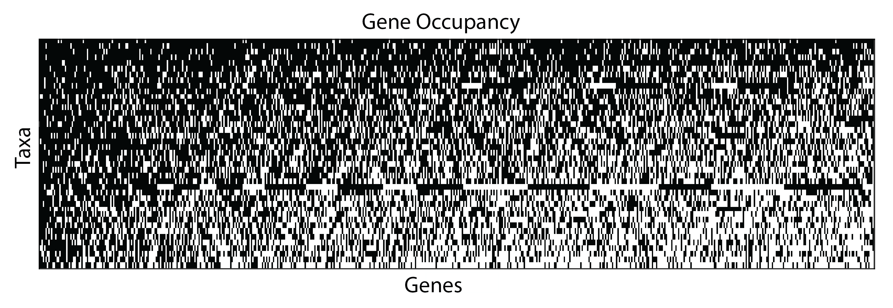

```{r preliminaries, include=FALSE}
	# Load packages

	# General
	library( tidyverse )
	library( stringr )
	library( forcats )
  library( magrittr )
	library( digest )
	library( knitr )
	library( jsonlite )
	library( parallel )

	# Formatting
  library( xtable )

	# Graphics
	library( cowplot )
	library( ggtree )
	library( fields ) # tim.colors
	library( seriation )
	library( gridExtra )
  library( factoextra )
  library( FactoMineR )

	# Biological
	library( hutan )	# https://github.com/caseywdunn/hutan
	library( ape )
	library( picante )  # cor.table
	library( phytools ) # phylosig
  library( vegan )
  library( ggtree )
  library( phangorn )
  library( geiger )
  library( phylobase )
  library( adephylo )
  library( geomorph ) #physig
  library( phylolm )

	# Configure knitr, see http://yihui.name/knitr/options
	opts_knit$set( 
	  progress=TRUE, 
	  verbose=TRUE)
	
	opts_chunk$set(
	#  include=FALSE, 
	  cache=TRUE,
	  echo=FALSE,
	  message=FALSE
	 )

	# Set system computational parameters
	cores = detectCores() - 1
	if ( cores < 1 ) {
		cores = 1
	}
	set.seed( 23456 )

	# Set paths to input data
	tree_path = "agalma/Outfiles/"
	input_file_ml = paste( tree_path, "RAxML_bipartitions.alignment.fa", sep="" )
	input_file_bootstraps = paste( tree_path, "RAxML_bootstrap.alignment.fa", sep="" )
	
	input_files_phylobayes = list.files( 
	  path=tree_path, 
	  pattern="chain\\d+_trimmed60_poisson.treelist" 
	 )
	
	# Analysis parameters
	burn_in = 400
	
```

```{r functions}

  get_node_support = function(  tree, treeset, threshold=100 ){
    # Returns a vector corresponding to nodes in tree, with percent of trees 
    # in treeset that contain the corresponding bipartition
    clades = prop.clades(tree, treeset) / length(treeset)
    nodes = c(rep(NA,length(tree$tip.label)), round(clades*100)) # Offset with NA values for tips
    nodes[ length(tree$tip.label) + 1 ] = NA # Set the root value to NA, not a robust way to find root but works in this case
    
    nodes[ nodes >= threshold  ] = NA
    
    return(nodes)
  }

  fix_names = function( tree ){
    # Apply changes to any tip names
    tree$tip.label = sub( '_', ' ', tree$tip.label ) # Change first underscore to space
    tree$tip.label = sub( 'sp_', 'sp', tree$tip.label ) # Fix trailing _ in Physonect sp_
    return( tree )
  }

```


```{r load_data}

	species_tree = ape::read.tree( input_file_ml )
  species_tree = fix_names( species_tree )
  species_tree_unladder =species_tree
  
  bootstrap_trees = ape::read.tree( input_file_bootstraps )
  
  phylobayes_trees = sapply(
    input_files_phylobayes,
    function( pb ) {
      ape::read.tree( 
        paste( tree_path, pb, sep = "" ) 
      )[ -(1:burn_in)  ]
    }
  )
  
  phylobayes_trees = unlist( phylobayes_trees,recursive=FALSE )
  class( phylobayes_trees  ) = "multiPhylo"
  
  bootstrap_trees = lapply( bootstrap_trees, fix_names )
  phylobayes_trees = lapply( phylobayes_trees, fix_names )

```

```{r pre_process_species_trees}

	species_tree = ape::ladderize( species_tree )

	species_tree = 
	  ape::root( 
	    species_tree, 
	    c( "Nematostella vectensis", "Aiptasia pallida" ), 
	    resolve.root=TRUE 
	   )

  
  # Repartition length of edges descended from root so they are non-zero
	species_tree = hutan::slide_root_edges( species_tree )

	# species_tree = ape::unroot(species_tree)

	stopifnot( species_tree$Nnode == length( species_tree$node.label ) )

	
	# Make ultrametric tree
	# By default, root has a depth of 1
	species_ultrametric = chronos( species_tree, lambda=1, model="correlated", quiet=TRUE )
	class( species_ultrametric ) = "phylo"

```


# Siphonophore Phylogeny

Catriona Munro^1^\*, Stefan Siebert^1,2^\*, Felipe Zapata^1,3^, Mark Howison^4^, Alejandro Damian Serrano^1,9^, Samuel H Church^1,5^, Freya Goetz^1,6^, Phil Pugh^7^, Steven H.D. Haddock^8^, Casey W. Dunn^1,9^**

^1^ Department of Ecology and Evolutionary Biology, Brown University, Providence, RI 02912, USA

^2^ Current address: Department of Molecular & Cellular Biology, University of California at Davis, Davis, CA 95616, USA

^3^ Current address: Department of Ecology and Evolutionary Biology, University of California Los Angeles, Los Angeles, CA 90095, USA

^4^ Brown Data Science Practice, Brown University, Brown University, Providence, RI 02912, USA

^5^ Department of Organismic and Evolutionary Biology, Harvard University, Cambridge, MA 02138, USA

^6^ Current address: Smithsonian Institution, National Museum of Natural History, Washington, DC 20560, USA

^7^ National Oceanography Centre, Southampton, SO14 3ZH, UK 

^8^ Monterey Bay Aquarium Research Institute, Moss Landing, CA 95039, USA

^9^ Current address: Department of Ecology and Evolutionary Biology, Yale University, New Haven, CT 06520, USA

\* Authors contributed equally

\*\* Corresponding author, casey.dunn@yale.edu

## Abstract

## Introduction

Siphonophores are a group of 188 valid species within Hydrozoa (Cnidaria), the vast majority of which are members of the plankton (fig. 1). Siphonophores are colonial, and are composed of zooids that are each homologous to solitary animals, but are physiologically integrated [@totton1965synopsis; @mackie1988siphonophore; @dunn2006evolution]. Siphonophores differ significantly from all other colonial hydrozoans in terms of colony structure, development, and the degree to which they are functionally specialized [@Beklemishev1969;@cartwright2010character]. A siphonophore colony arises from a single embryo, which forms a protozooid and a growth zone from which other genetically identical zooids bud asexually [@carre1969etude;@carre1991complete;@carre1967;@carre1995ordre]. Each zooid is generated asexually, arises in the same repeating species-specific pattern, and is functionally specialized for a particular task (e.g feeding, reproducing, swimming) (fig. 2) [@dunn2006evolution]. Siphonophores are found at all depths - most species are planktonic, with the exception of one pleustonic species (*Physalia physalis*, Portuguese man of war) that lives at the interface of water and air, and a small clade of benthic siphonophores, the Rhodaliidae [@carre1995ordre;@Totton1960;@pugh1983benthic]. They are among the most abundant gelatinous predators in the open ocean, and play an important ecological role in oceanic waters [@pugh1984diel;@pugh1997vertical; @williams1981vertical;@purcell1981dietary;@pages2001gelatinous]. 

Siphonophores are monophyletic and nested within the Hydroidolina, although relationships among the major lineages of the Hydroidolina remain difficult to resolve [@cartwright2010character;@Cartwright2008kl;@zapata2015phylogenomic]. The most resolved siphonophore phylogeny to date focused on two genes (16S, 18S) from 52 siphonophore taxa, and resolved many long standing questions about siphonophore biology, including the relationships of the three historically recognised groups (Cystonectae, Physonectae, and Calycophorae) [@Dunn:2005dy]. The cystonects were found to be sister to all other siphonophores, while the calycophorans were nested within physonects (the name Codonophora was given to this clade)[@Dunn:2005dy]. 

![Photographs of representatives of the major groups of siphonophores. (A) *Rhisophysa eysenhardtii*, scale bar = 1 cm. (B) *Bathyphysa conifera*, scale bar = XXX. (C) *Hippopodius hippopus*, scale bar = 5 mm. (D) *Physophora hydrostatica*, scale bar = 5 mm. (E) *Nanomia bijuga*, scale bar = 1 cm. (F) *Desmophyes haematogaster*, scale bar = 5 mm. (G) *Sphaeronectes christiansonae*, scale bar = 2 mm. (H) *Lychnagalma utricularia*, scale bar = 1 cm. (I) *Kephyes hiulcus*, scale bar = 2 mm. (J) *Praya dubia*, scale bar = 4 cm . (K) *Apolemia sp.*, scale bar = 1 cm.](figures/Figure1.jpg)

The Apolemiidae are sister to all other Codonophora, however there was little resolution of deep relationships within Codonophora. The history of colony structure and budding was investigated by mapping these traits to the tree, and suggesting a complex history of zooid gain and loss. Resolving deep relationships within Codonophora is key to resolving the evolution of several character traits, including sexual systems (monoecy vesus dioecy) or the gain and loss of particular zooids, such as palpons. 

Siphonophores are difficult to collect, in part because they are fragile (nets destroy all but the most robust parts of the colony), but also because many species are found in the deep sea [@youngbluth1984water;@Dunn:2005dy]. Specimen sampling for the previous phylogeny, and this new work, is enabled by modern collection techniques, including blue-water scuba diving and remotely operated vehicles (ROVs). Here we present a broadly sampled phylogenomic analysis of Siphonophora, assessing transcriptomic data from 34 siphonophore species and 9 outgroup species. Using 1071 genes shared across species, we are able to resolve deep relationships within the siphonophore phylogeny and reconstruct the evolutionary history of characters, including zooid type, life history traits, and habitat. 

![Schematic of the siphonophore *Nanomia bijuga*, oriented with the anterior of the colony at the top, and the ventral side to the left. Adapted from http://commons.wikimedia.org/wiki/File:Nanomia_bijuga_whole_animal_and_growth_zones.svg, drawn by Freya Goetz. (*A*) Overview of the whole mature colony. (*B*) Inset of the nectosomal growth zone with pneumatophore. A series of buds gives rise to nectophores. (*C*) Inset of the siphosomal growth zone. Probuds subdivide to give rise to zooids in repeating-units (cormidia). Cormidial boundaries are marked by a gastrozooid.](figures/Figure2.pdf)


## Methods

This manuscript is an executable document computed directly from the data, providing an explicit and reproducible description of all findings. All scripts for the analyses are available in a git repository at [https://github.com/caseywdunn/siphonophore_phylogeny_2017](https://github.com/caseywdunn/siphonophore_phylogeny_2017). The most recent commit at the time of the analysis presented here was `r system("git log | head -n 1", intern=TRUE) %>% str_replace("commit ", "")`.


#### Collecting

Collection data on all examined specimens, a description of the tissue that was sampled from the colony, collection mode, sample processing details, mRNA extraction methods, sequencing library preparation methods and sequencing details are summarized in supplementary table 1. Monterey Bay and Gulf of California specimens were collected by remotely operated underwater vehicle (ROV) or during blue-water scuba dives. *Chelophyes appendiculata* and *Hippopodius hippopus* specimens were collected in the bay of Villefranche-sur-Mer, France, during a plankton trawl on 04/13/11. Available physical vouchers have been deposited at the Museum of Comparative Zoology (Harvard University), Cambridge, MA, or had been previously deposited at the United States National Museum (Smithsonian Institution), Washington, DC. Accession numbers are given in supplementary table X. In cases where physical vouchers were unavailable we provide photographs to document species identity (table x).

#### Sequencing

When possible specimens were starved overnight in filtered seawater at temperatures close to ambient water temperatures at the time point of specimen collection (supplementary table x). mRNA was extracted directly from tissue using a variety of methods (supplementary table x): Magnetic mRNA Isolation Kit (NEB, #S1550S), Invitrogen Dynabeads mRNA Direct Kit (Ambion, #61011), Zymo Quick RNA MicroPrep (Zymo #R1050), or from total RNA after Trizol (Ambion, #15596026) extraction and through purification using Dynabeads mRNA Purification Kit (Ambion, #61006)-  in case of anticipated very small total RNA quantities, only a single round of bead purification was performed; or Trizol directly into the Illumina TruSeq Stranded Library Kit. Extractions were performed according to the manufacturer's instruction.  Any resulting higher rRNA read counts were dealt with further downstream in the bioinformatics workflow. Libraries were prepared for sequencing using the Illumina TruSeq RNA Sample Prep Kit (Illumina, #FC-122-1001, #FC-122-1002), the Illumina TruSeq Stranded Library Prep Kit (Illumina, #RS-122-2101) or the NEBNext RNA Sample Prep Master Mix Set (NEB, #E6110S). We collected long read paired end Illumina data for *de novo* transcriptome assembly. In the case of large tissue inputs, libraries were sequenced separately for each tissue, subsequently subsampled and pooled *in silico*. Libraries were sequenced on the HiSeq 2000, 2500, and 3000 sequencing platforms (supplementary table x). 


#### Analysis

New data were analysed in conjunction with 13 publically available datasets, with a total number of 43 species. Sequence assembly, annotation, Maximum Likelihood (ML) phylogenetic analysis were conducted with the tool Agalma [@Dunn:2013kw], v. 1.00, and Bayesian Inference (BI) analyses were conducted using Phylobayes[@lartillot2009phylobayes] v. 1.7a-mpi. Source code for all analysis steps, sequence alignments, sampled and consensus trees, and voucher information are available in a git repository https://github.com/caseywdunn/siphonophore_phylogeny_2017.  

Two outgroup species, *Atolla vanhoeffeni* and *Aegina citrea*, were removed from the final supermatrix and phylogeny due to low gene occupancy (gene sampling of 20.8% and 14.5% respectively in a 50% occupancy matrix with 2,203 genes). ML analyses were conducted on the unpartitioned supermatrix using the WAG+$\Gamma$ model of amino acid substitution, and bootstrap values were estimated using 1000 replicates. BI was conducted using two different CAT models, CAT-Poisson and CAT-GTR [@doi:10.1093/molbev/msh112]. Two independent MCMC chains were run under the CAT-GTR model, and four independent MCMC chains were run under the CAT-Poisson model. The CAT-GTR and CAT-poisson models did not converge after a long CPU time, and only the results from the CAT-poisson model are included here.

Morphological character data used in trait mapping were obtained from the literature, or from direct observation of available voucher material. We used stochastic character mapping to infer the probable evolution of traits on the tree in R using the `phytools` package [@MEE3:MEE3169, @huelsenbeck2003stochastic].  Subsequent analyses were conducted in R and integrated into this manuscript with the `knitr` package. See Supplementary Information for R package version numbers.

#### Hypothesis testing
We used the Swofford-Olsen-Waddell-Hillis (SOWH) test [@swofford1996phylogenetic] to evaluate two hypotheses: (i) physonects are monophyletic [@totton1965synopsis]; (ii) monoecious species are monophyletic [@Dunn:2005dy]. As the sexual system of *Rudjakovia sp* is unclear, we carried out two tests of the monophyly of monoecy, one with *Rudjakovia sp* included as a monoecious species, and one without. We used SOWHAT [@doi:10.1093/sysbio/syv055] dev. version 0.39 (commit fd68ef5733c095c7000a4f92dc8c0daaddeec3b9) to carry out the SOWH tests in parallel with the default options and an initial sample size of 100 (source code can be found in the git repository). For each hypothesis we defined a topology with a single constrained node that was inconsistent with the most likely topology (figure 3 x). We used a threshold for significance of 0.05 and following the initial 100 samples, we evaluated the confidence interval around the p-value to determine if more samples were necessary.  

## Results

### Species phylogeny and hypothesis testing

Specimens were collected in the eastern Pacific Ocean, Mediterranean, and the Gulf of California (table 1). All sequence data have been deposited in the sequence read archive (SRA). The analyses presented here consider 34 siphonophore species and 9 outgroup species. This includes new data for 30 species. Summary statistics for expression libaries are given in supplementary table x. In the final analyses, we sampled 1,071 genes to generate a supermatrix with 60% occupancy and a length of 378,468 amino acids (gene occupancy matrix - supplementary figure 1). 
```{r specimen_summary, results='asis', echo=FALSE, comment=NA, warning=FALSE}
specimen_data <- read.csv("supplementary_info/Specimen_data.csv")
names(specimen_data)<-c("New data","Species","ID","SRA Number", "Library ID", "Library type","Tissue","Sequencer", "Sequencing center", "Sample prep","Collected by","Collection date","Specimen id","Depth (m)","Geo loc name","Lat Lon","Voucher Type","Voucher location","Voucher Cat No.","Collection mode")

specimen_data_reduced <- specimen_data[,c(1,2,4,14,16)]
specimen_data_reduced$`New data`<-sub("^N"," ",specimen_data_reduced$`New data`)

xtable_specimen<-xtable(specimen_data_reduced,auto=TRUE, caption="Table 1. A complete list of specimens collected for this work. New data indicated by Y, blank fields indicate that data are already published.")
print(xtable_specimen,comment=F, include.rownames=FALSE, scalebox='0.75')

```
Maximimum likelihood analyses had `r length(bootstrap_trees)` replicates. We ran `r length( input_files_phylobayes )` phylobayes chains, and visual inspection of the traces indicated that a burn in of `r burn_in` trees was sufficient for all runs. This left `r length( phylobayes_trees )` trees in the posterior. The phylobayes chains did not converge after a long CPU time, and uncertainty remains around the placement of *Erenna richardi*, and also *Nanomia bijuga*. Within the ML analysis, the placement of *Erenna richardi* is also unstable. Alternative topologies for these nodes are shown in figure 3 x. 

```{r species_phylogram, echo=FALSE, comment=NA, warning=FALSE, fig.width=6.5, fig.height=7, fig.cap="Phylogram of siphonophore relationships. Node labels indicate bootstrap support percent, unnumbered nodes have 100% support. The image was rendered with ggtree [@Yu:2016fo]" }

	siphonophora_node = ape::mrca( species_tree )[ "Physalia physalis", "Agalma elegans" ]
	cystonectae_node = ape::mrca( species_tree )[ "Physalia physalis", "Rhizophysa filiformis" ]
	calycophora_node = ape::mrca( species_tree )[ "Kephyes ovata", "Hippopodius hippopus" ]
	euphysonectae_node = ape::mrca( species_tree )[ "Agalma elegans", "Erenna richardi" ]

	support = as.numeric( species_tree$node.label )
	support[ support > 99 ] = NA

	# pad tip values
	support = c( rep( NA, length( species_tree$tip.label ) ), support )
  
	
	
	
	p_phylogram = ggtree( species_tree ) +
			# geom_text( aes( label=support ), vjust=-.5, hjust=1, size=2.5, col="darkslategray4" ) +
	    geom_text(aes(label=get_node_support(species_tree, bootstrap_trees)), vjust=-.5, hjust=1, size=2.5, col="red") +
      geom_text(aes(label=get_node_support(species_tree, phylobayes_trees)), vjust=1.5, hjust=1, size=2.5, col="blue") +
			geom_tiplab( size=3 ) +
			xlim( NA, 4 ) +
			geom_cladelabel( node=cystonectae_node, label="Cystonectae", align=FALSE, offset=1, color='red' ) +
			geom_cladelabel( node=calycophora_node, label="Calycophora", align=FALSE, offset=1, color='blue' ) +
			geom_strip(
				which( species_tree$tip.label=="Agalma elegans" ),
				which( species_tree$tip.label=="Apolemia white" ),
				barsize=0.5,
				color='orange',
				offset=1,
				label='"Physonectae"'
			) +
			geom_strip(
				which( species_tree$tip.label=="Hydractinia symbiolongicarpus" ),
				which( species_tree$tip.label=="Nematostella vectensis" ),
				barsize=0.5,
				color='gray',
				offset=1,
				label='"Outgroups"'
			)

	flip( p_phylogram, euphysonectae_node, calycophora_node )

```

These findings are largely consistent with a previous analysis based on two genes (16S and 18S ribosomal RNA) (figure 3) [@Dunn:2005dy]. Cystonectae is the sister group to the remaining siphonophores, Calycophorae is nested within the paraphyletic "Physonectae", and *Apolemia* is sister to all other Codonophora. In addition, multiple nodes that were not resolved in the previous two-gene analysis do recieve strong support in this 1,071-gene transcriptome analysis. *Physophora gilmeri*, along with *Lychnagalma utricularia* (not included in previous phylogeny) are sister to the Agalmatidae *sensu stricto*. *Craseoa lathetica* and *Desmophyes haematogaster* are sister to *Hippopodius hippopus*. *Cordagalma cordiforme* was previously unresolved, while in this analysis *Cordagalma sp* falls within the Agalmatidae.  Additionally, there is strong support for *Bargmannia* as sister to all non-Apolemid codonophorans. 

We tested the following three alternative phylogenetic hypotheses against the most likely tree topology: (i) physonect siphonophores are monophyletic, (ii) monoecious siphonophores (not including *Rudjakova sp.*) are monophyletic, and (iii) monoecious siphonophores (including *Rudjakova sp.*) are monophyletic (figure 3 xx). In all three cases the alternative hypothesis was rejected (p-value <0.01, confidence interval: <0.001 - 0.03).

## Character Evolution

The morphological character matrix, and all the code used to generate the character mapping is available in the git repository and in the supplementary materials. A  number of traits were mapped to branches on the phylogeny, including: the presence/absence of palpons, tentilla, bracts, pneumatophores, nectosome, and eudoxia, monoecy vs dioecy, the orientation of nectosome relative to siphosome, as well as the median vertical distribution (fig 4, 5, supplementary figures 2-5).  

```{r char_evo_setup, include=F, echo=F}
#Load data
read.csv('character_coding/main_characters.csv', header = T, sep = ',') -> cdata
cdata$Species = str_replace_all(cdata$Species, "sp ", "sp")
rownames(cdata) = cdata$Species

#Load tree
tree = species_tree_unladder
tree <- drop.tip(tree, which(!(tree$tip.label %in% rownames(cdata))))
#tree<-rotateNodes(tree,nodes=c(28,31))

ultratree <- chronos(tree)
class( ultratree ) = "phylo"
nodes_to_rotate = c(ape::mrca(ultratree)["Physalia physalis","Kephyes ovata"], ape::mrca(ultratree)["Bargmannia lata","Hippopodius hippopus"])
ultratree<-rotateNodes(ultratree,nodes=nodes_to_rotate)

#Temporarily prune data
cdata %<>% filter(rownames(.) %in% tree$tip.label)
rownames(cdata) = cdata$Species
cdata %<>% .[-1]

#Named vectors for variables
sex = cdata$Sex
names(sex) = rownames(cdata)

nectosome = cdata$Nectosome
names(nectosome) = rownames(cdata)

necto_pos = cdata$Nectosome.position
names(necto_pos) = rownames(cdata)

necto_types = cdata$Nectophores
names(necto_types) = rownames(cdata)

palpons = cdata$Palpons
names(palpons) = rownames(cdata)

tentilla = cdata$Tentilla
names(tentilla) = rownames(cdata)

tentilla2 = tentilla
tentilla2['Physalia physalis'] = 1 #In the scenario where we consider Physalias knobs reduced not lost tentilla

bracts = cdata$Bract.types
bracts[which(bracts>0)] <- 1  #bracts changed to presence absence for tip annotation
names(bracts) = rownames(cdata)
cdata$Bract.types = bracts
names(cdata)[8] = "Bracts"

vrange = cdata$Vertical.range
names(vrange) = rownames(cdata)

#Depth pruned data
dpruned_data = cdata[which(!is.na(cdata$Depth.Median)), ]
dpruned_tree <- drop.tip(ultratree, which(!(ultratree$tip.label %in% rownames(dpruned_data))))
dpruned_data <- dpruned_data[match(dpruned_tree$tip.label, rownames(dpruned_data)),]

depth_median = dpruned_data$Depth.Median
names(depth_median) = rownames(dpruned_data)

depth_mean = dpruned_data$Depth.Mean
names(depth_mean) = rownames(dpruned_data)

depth_min = dpruned_data$Depth.Min
names(depth_min) = rownames(dpruned_data)

depth_max = dpruned_data$Depth.Max
names(depth_max) = rownames(dpruned_data)

depth_sd = dpruned_data$Depth.StdDev
names(depth_sd) = rownames(dpruned_data)

depth_range = depth_max - depth_min

abundance = dpruned_data$Depth.Count
names(abundance) = rownames(dpruned_data)

```

```{r simmap_making, echo=F, message=F, warning=F, include=F}
#Stochastic trait mapping:
#Make simmap objects
#print("SIMMAP Sex Distribution")
make.simmap(ultratree, sex, nsim = 100, message=FALSE) -> sex_sim
#print("SIMMAP Palpons")
make.simmap(ultratree, palpons, nsim = 100, message=FALSE) -> palpons_sim
#print("SIMMAP Tentilla")
make.simmap(ultratree, tentilla, nsim = 100, message=FALSE) -> tentilla_sim
#print("SIMMAP Tentilla2")
make.simmap(ultratree, tentilla2, nsim = 100, message=FALSE) -> tentilla_sim2
#print("SIMMAP Nectosome")
make.simmap(ultratree, nectosome, nsim = 100, message=FALSE) -> nectosome_sim
#print("SIMMAP Nectosome Position")
make.simmap(ultratree, necto_pos, nsim = 100, message=FALSE) -> necto_pos_sim
#print("SIMMAP Nectophore Types")
make.simmap(ultratree, necto_types, nsim = 100, message=FALSE) -> necto_types_sim
#print("SIMMAP Bracts")
make.simmap(ultratree, bracts, nsim = 100) -> bracts_sim
#print("SIMMAP Habitat")
make.simmap(ultratree, vrange, nsim = 100, message=FALSE) -> vrange_sim

```

```{r sex, echo=F, message=F, warning=F, include=F}
par(ask=F)
#Simmap SEX
#plotTree(ultratree, lwd = 4)
#colors = c("black", "red")
#names(colors) = c("Dioecious", "Monoecious")
#sex_sim %>% plotSimmap(lwd = 4, add = T, colors=colors)
#nodelabels(pie=(describe.simmap(sex_sim, plot=F)$ace) ,piecol=colors,cex=0.35)
#add.simmap.legend(colors = colors, x=0.6*par()$usr[1],y=0.3*par()$usr[4],prompt=FALSE)
# pdf("figures_for_AI/density_sex_sim.pdf")
# densityMap(sex_sim)
# dev.off()
```

```{r palpons, echo=F, message=F, warning=F, include=F}
#Simmap PALPONS
# plotTree(ultratree, lwd = 4)
# colors = c("black", "red")
# names(colors) = c("Absent", "Present")
# palpons_sim %>% plotSimmap(lwd = 4, add = T,colors=colors)
# nodelabels(pie=(describe.simmap(palpons_sim, plot=F)$ace) ,piecol=colors,cex=0.35)
# add.simmap.legend(colors = colors, x=0.6*par()$usr[1],y=0.3*par()$usr[4],prompt=FALSE)
# pdf("figures_for_AI/palpons_sim.pdf")
# densityMap(palpons_sim)
# dev.off()
```

```{r vars_plot, echo=F, message=F, warning=F, include=F}
#Get Raw Data
raw_data = read.csv(file="character_coding/trim_siphdepths.tsv", sep = "\t")[,c(4,3,5:11)]
raw_data = raw_data[order(raw_data$ConceptName),]

#Clean Raw Data
names(raw_data)[1] = "Species"
raw_data$Species = as.character(raw_data$Species)
raw_data$Species[which(raw_data$Species == "Kephyes")] = "Kephyes ovata"
raw_data$Species[which(raw_data$Species == "Lilyopsis")] = "Lilyopsis fluoracantha"
raw_data$Species[which(raw_data$Species == "Agalma")] = "Agalma elegans"
raw_data$Species[which(raw_data$Species == "Frillagalma")] = "Frillagalma vityazi"
raw_data$Species[which(raw_data$Species == "Stephalia")] = "Stephalia dilata"
raw_data$Species[which(raw_data$Species == "Lychnagalma")] = "Lychnagalma utricularia"
raw_data$Species[which(raw_data$Species == "Craseoa")] = "Craseoa lathetica"
raw_data$Species[which(raw_data$Species == "Cordagalma")] = "Cordagalma sp"
raw_data$Species[which(raw_data$Species == "Desmophyes haematogaster")] = "Prayidae D27SS7"
raw_data$Species[which(raw_data$Species == "Craseoa lathetica")] = "Prayidae D27D2"
raw_data$Species[which(raw_data$Species == "Rudjakovia")] = "Rudjakovia sp"
raw_data$Species[which(raw_data$Species == "Thermopalia")] = "Thermopalia sp"
raw_data$Species[which(raw_data$Species == "Physonectae sp. 1")] = "Physonect sp"

#Adjust Data to tree structure
raw_data[which(raw_data$Species %in% ultratree$tip.label),] -> intree_data
tree$tip.label[which(!(ultratree$tip.label %in% raw_data$Species))] %>% length() -> missSPP
missing_data_proxy <- raw_data[1:missSPP,]
missing_data_proxy$Species = ultratree$tip.label[which(!(ultratree$tip.label %in% raw_data$Species))]
missing_data_proxy$Depth = rep(20, missSPP)
parched_data <- rbind(missing_data_proxy, raw_data[which(raw_data$Species %in% ultratree$tip.label),])
parched_data = parched_data[which(!is.na(parched_data$Depth)),]
parched_data$Species <- factor(parched_data$Species, levels = ultratree$tip.label)

#90% Cut-off of extrame values
SPDepths = parched_data[,1:2]
byspp_SPD = split(SPDepths, SPDepths$Species)
for(i in 1:length(byspp_SPD)){
  if(nrow(byspp_SPD[[i]])>200){
#   byspp_SPD[[i]] = sample_n(byspp_SPD[[i]], 0.02*nrow(byspp_SPD[[i]]))
    byspp_SPD[[i]] = sample_n(byspp_SPD[[i]], 200)
  }
}
trimmed_SDdata = bind_rows(byspp_SPD)

sp_order = c("Agalma elegans", "Athorybia rosacea", "Halistemma rubrum", "Nanomia bijuga", "Lychnagalma utricularia", "Physophora gilmeri", "Forskalia asymmetrica", "Cordagalma sp", "Resomia ornicephala", "Frillagalma vityazi", "Physonect sp", "Marrus claudanielis", "Stephalia dilata", "Thermopalia sp", "Erenna richardi", "Abylopsis tetragona", "Diphyes dispar", "Chelophyes appendiculata", "Kephyes ovata", "Chuniphyes multidentata", "Lilyopsis fluoracantha", "Prayidae D27D2", "Prayidae D27SS7", "Hippopodius hippopus", "Bargmannia amoena", "Bargmannia elongata", "Bargmannia lata", "Rudjakovia sp", "Apolemia rubriversa", "Apolemia lanosa", "Apolemia sp", "Rhizophysa filiformis", "Physalia physalis")

trimmed_SDdata$Species = as.character(trimmed_SDdata$Species)
trimmed_SDdata = trimmed_SDdata[which(!is.na(trimmed_SDdata$Species)),]
trimmed_SDdata$Species <- factor(trimmed_SDdata$Species, levels = sp_order)

#ggplot(trimmed_SDdata, aes(x = Species, y=-Depth)) + geom_boxplot() + theme_classic()

# pdf("figures_for_AI/trimmed_violinVars.pdf")
# ggplot(trimmed_SDdata, aes(x = Species, y=-Depth)) + geom_violin() + theme_classic()
# dev.off()
```

```{r ggtree_bin_heatmap, echo=F, message=F, warning=F, include=F}
p <- ggtree(ultratree)
p <- p + geom_tiplab(size=2.2)
f_cdata = sapply(cdata, as.factor) %>% as.data.frame %>% .[c(1,2,5:8,12)]
rownames(f_cdata) = rownames(cdata)
f_cdata = f_cdata[,c(4,7,1,3,6,2,5)]
f_cdata[match(tree$tip.label,rownames(f_cdata)),]
# pdf("figures_for_AI/overview_ggheatmap_chars.pdf")
# gheatmap(p, f_cdata, offset = 0.4, width=0.5, colnames_position = 'top', font.size = 1)
# dev.off()
```

##Discussion

###Siphonophore Phylogeny

The strong phylogenetic signal in the characters traditinally used for taxonomic diagnostics is a positive indicator of the applicability and unambiguity of these characters.


In our previous siphonophore phylogenetic analysis [@Dunn:2005dy] there were several characters left with equivocal evolutionary histories, due to unresolved relationships between physonects. With our current cladistic resolution, we were able to answer some of the questions left open:

###Evolution of Monoecy

[Citation needed] noticed for the first time that some siphonophores were monoeicous and others were dioiecious. Our analyses in 2005 reconstructed this character and found a great amount of phylogenetic conservatism, with an unambiguous resolution of the MRCA (most recent common ancestor) as dioecious, and the appearance of monoecy in several taxa and clades (including Calycophorae) within the polytomy. Figure 5a shows the evolution of sex distribution in siphonophores under the current better-resolved tree model, and it strongly indicates that monoecy in siphonophores from a dioecious ancestor occured twice, in the branch leading to Calycophorae and in the branch leading to Agalmatids (sensu lato). There is a small probability for an alternative scenario featuring a single gain of monoecy before the split of Calycophorae, with a subsequent derived shift back to dioecy in the *Marrus-Erenna* clade.


###The Evolution of Zooid Types

One of the most striking aspects of siphonophore biology is their diversity of unique zooid types. Other colonial cnidarians (such as Hydractinia) and some bryozoans (example) have been found to have up to X different zooid types [Citation1 , Citation 2]. The siphonophore genus Forskalia has 6 basic zooid types (pneumatophore, nectophore, gastrozooid, palpon, bract, and gonophore), and a total of 10 counting subtypes (4 types of bract, male & female gonophores). Diphyomorphs have more than 1 type of nectophore, while Cystonects have none. Here we reconstruct the evolutionary origins ofthe different zooid types on the present transcriptome tree.

Nectophores are retained modified medusae that Codonophora use for coordinated colony-level swimming. The nectosome is the region of the colony that develops from the nectosomal growth zone. Unlike the siphosomal growth zone, the nectosome does not bud gastrozooids, but nectophores (and in the case of *Apolemia*, also palpons). If fact, with the exception of  *Physalia physalis* (which grows small nectophores near the gonodendra), siphonophore nectophores are exclusively found on the nectosome. It is possible that the MRCA of siphonophores had a nectosome, which has lost on the branch leading to Cystonects. We cannot exclude with certainty the alternative hypothesis of a nectosome-less ancestor followed by a gain of the nectosome in the branch leading to the Codonophora. The nectosome probably arose as a duplication of the siphosome, followed by functional specialization in propelling the colony. The nectosome has been lost within Codonophora in the genus *Athorybia*.

Following the colony development orientation framework presented in (citation), the nectosome can be located in a dorsal or a ventral position. Our ancestral reconstructions for this character (Supp figure) show that a ventrally-oriented nectosome was the ancestral form in siphonophores, and that a dorsal nectosome has evolved twice independently, in the braches leading to the Agalmatidae (sensu stricto) and the branch leading to the *Bargmannia* species.

All Codonophora (with the exception of *Athorybia* species) have a nectosome, but the number and subtypes of nectophores present varies greatly between species. As shown in Figure X, most Codonophora presents the ancestral nectosome with multiple nectophores of the same subtype. However, Calycophorans evolved a different system with just 2 nectophores of one type. This shift may be associated with the loss of the pneumatophore. Not all Calycophorans remained with this arrangement. The Hippopodidae returned to bearing multiple identical nectophores, many of which are inactive and serve functions of defense (like a shell to retract in) and buoyancy. As in the rest of Calycophorans, the Hippopodids only use 2 nectophores to propel the colony. Another interesting shift occurs in the branch leading to Diphyomorpha, where the 2 nectophores specialize into 2 subtypes, associated with a shift into a vertically aligned position and pointed bell shapes. The 2 types function together in a coupled hydrodynamic system that allows very fast escape responses (Mackie 1964).

Bracts are highly reduced zooids unique to siphonophores, but they are only present in the Codonophora. As with the nectosome, we have ambiguity determining whether the MRCA of siphonophores had bracts or not. The MRCA of Codonophora ahd only one bract subtype, which was lost in Hippopodidae, *Physophora hydrostatica* (however, they are present in its sister species, *P. gilmeri* included in the present phylogeny), and in *Gymnopraia lapislazula*. Bracts are functional for protection of the delicate zooids and to help maintain neutral buoyancy. Some calycophorans are able to actively exclude suphate ions in their bracts to adjust their buoyancy along the colony (Bidigare & Biggs, 1980).

The ancestral siphonophore certainly had a pneumatophore, since both Cystonects and most Codonophorans possess one (Figure 4). This unique zooid fills itself with gas, which helps the colony float and maintain its orientation in the water column. Recent evidence of neural arrangement in the pneumatophore of *Nanomia bijuga*  (Church, 2013) suggests it could also gather information on relative pressure changes (and thus depth changes), helping regulate geotaxis. Despite its multiple biological functions, it was lost in the Calycophorae and never gained again in that clade. Calycophorans rely on the ionic balance of their gelatinous nectophores and bracts to retain posture and neutral buoyancy.

Palpons are modified mouthless gastrozooids used for digestion and circulation of the gastrovascular fluid. They were present in the MRCA of siphonophores (Figure 5b), retained in most species, but lost three times independently in the branches leading to *Pyrostephidae* (represented here by the genera *Bargmannia* and *Rudjakovia*), in Calycophorans, and in *Marrus claudanielis*. These taxa might have found other avenues to effectively circulate nutrients across the colony.

###The Gain and Loss of Tentilla

The most complex nematocyst batteries of Cnidaria can arguably be found among the siphonophores, hanging in regularly spaced tentacle side branches called tentilla. Most hydrozoans, including the clade that contains siphonophores, bear simple tentacles (tentacles with no side branches). It is still an open question whether the MRCA of Siphonophora had simple or branched tentacles. The only siphonophores genera regarded as lacking tentilla are *Physalia physalis* and *Apolemia* spp., and *Bathyphysa conifera*. Since *B. conifera* is the only member of the *Rhizophysidae* (and of the *Bathyphysa* genus) lacking tentilla, we can safely assume this is a case of secondary loss. When we reconstrauct the evolution of this character on the current phylogeny, we find that 70% of simulations support an MRCA bearing tentilla, with two independent losses leading to *Physalia* and *Apolemia*. However, this leaves a 30% support for a simple-tentacled MRCA followed by 2 independent gains of tentilla in the branches leading to *Rhizophysidae* and *{Bargmannia, Diphyes}*.

A key issue here is how we code for absence of tentilla, especially for the case of *Physalia physalis*. The tentacles of this species, when uncoiled, show very prominent, evenly spaced, bulging buttons which contain on their ectoderm all active and functionally arranged nematocysts used by the organism for prey capture. Siphonophore tentilla are complete diverticular brachings of the tentacle ectoderm, mesoglea, and gastrovascular canal (lined by endoderm). Hessinger & Ford 1988 (in the Biology of Nematocysts) described *Physalia*'s buttons as enclosing individual fluid-filled chambers connected by narrow channels to the tentacular canal, lined by endoderm. This suggests they are not just ectodermal swellings, but probably are reduced tentilla. When we code *Physalia physalis* as tentilla bearing, the results for the character reconstraction lead to a more robust support for a tentilla-bearing MRCA followed by a single loss of tentilla in the branch leading to *Apolemiidae* (Supp Figure).

Siphonophore tentilla present an astounding diversity of sizes, shapes, colors, and nematocyst complements, and some have been observed to rapidly uncoil in contact with prey. Future research should explore the evolutionary history of these unique structures.

###The Evolution of Vertical Habitat Use

Siphonophores are abundant predators in the pelagic realm, ranging from the surface (*Physalia physalis*) to bathypelagic depths (ref , Figure 4). While there are some pleustonic (*Physalia*) and benthic (*Rhodaliidae*) siphonophores, the phylogeny suggests the siphonophore MRCA was planktonic, as most extant taxa are. Some interesting questions arise from these facts, including 1) what was the bathymetric niche of the siphonophore MRCA, and 2) how did siphonophore's vertical habitat use of the water columns evolve along the phylogeny. Our results indicate a mesopelagic MRCA, with several convergent transition events to epipelagic and bathypelagic waters. There was only a single transition to benthic lifestyle on the stem of *Rhodaliidae*.

## Conclusions


## Acknowledgements

This work was supported by the National Science Foundation (DEB-1256695 and the Waterman Award). Sequencing at the Brown Genomics Core facility was supported in part by NIH P30RR031153 and NSF EPSCoR EPS-1004057. Data transfer was supported by NSF RII-C2 EPS-1005789. Analyses were conducted with computational resources and services at the Center for Computation and Visualization at Brown University, supported in part by the NSF EPSCoR EPS-1004057 and the State of Rhode Island. We also thank the MBARI crews and ROV pilots for collection of the specimens.

## Supplementary Information
\setcounter{figure}{0}
\setcounter{table}{0}
\makeatletter 
\renewcommand{\thefigure}{S\@arabic\c@figure}
\renewcommand{\thetable}{S\@arabic\c@table}
\makeatother

####Agalma analysis



```{r summary_table, results='asis', echo=FALSE, comment=NA, warning=FALSE}
	summary_stats = read.table("supplementary_info/Library_summary.csv", header=TRUE, sep=",")
	names(summary_stats)<-c("Species","Mean insert size (bp)","Insert size sd","# read pairs","% kept after rRNA removal","% kept after assembly","Adapter fails","Quality fails","Base Comp. fails","Total transcripts","Coding transcripts") 


#xtable_summary<-xtable(summary_stats, caption="Supplementary table 1.The assembly summary statistics for all included taxa, showing mean insert size, and the percentage of reads kept after pipeline steps.")
#align( xtable_summary ) <- c('l|','p{0.8in}','p{0.3in}','p{0.3in}','p{0.5in}','p{0.3in}','p{0.3in}','p{0.4in}','p{0.5in}','p{0.5in}','p{0.5in}','p{0.5in}')
#print(xtable_summary,include.rownames=FALSE,comment=F, floating =FALSE, tabular.environment = "longtable")

```

#####Stochastic Character maps
```{r tentilla, echo=F, message=F,warning=F, fig.width=6.5, fig.height=7, fig.cap= "Stochastic character map of presence of tentilla"}
#Simmap TENTILLA
# plotTree(ultratree, lwd = 4)
# colors = c("black", "red")
# names(colors) = c("Absent", "Present")
# tentilla_sim %>% plotSimmap(lwd = 4, add = T,colors=colors)
# nodelabels(pie=(describe.simmap(tentilla_sim, plot=F)$ace) ,piecol=colors,cex=0.35)
# add.simmap.legend(colors = colors, x=0.6*par()$usr[1],y=0.3*par()$usr[4],prompt=FALSE)
densityMap(tentilla_sim)
```

```{r tentilla2, echo=F, message=F, warning=F, fig.width=6.5, fig.height=7, fig.cap= "Stochastic character map of presence of tentilla with Physalia included"}
#Simmap TENTILLA
# plotTree(ultratree, lwd = 4)
# colors = c("black", "red")
# names(colors) = c("Absent", "Present")
# tentilla_sim2 %>% plotSimmap(lwd = 4, add = T,colors=colors)
# nodelabels(pie=(describe.simmap(tentilla_sim2, plot=F)$ace) ,piecol=colors,cex=0.35)
# add.simmap.legend(colors = colors, x=0.6*par()$usr[1],y=0.3*par()$usr[4],prompt=FALSE)
densityMap(tentilla_sim2)
```


```{r nectosome, echo=F, message=F, warning=F,  fig.width=6.5, fig.height=7, fig.cap= "Stochastic character map of presence of nectosome"}
#Simmap NECTOSOME
# plotTree(ultratree, lwd = 4)
# colors = c("black", "red")
# names(colors) = c("Absent", "Present")
# nectosome_sim %>% plotSimmap(lwd = 4, add = T,colors=colors)
# nodelabels(pie=(describe.simmap(nectosome_sim, plot=F)$ace) ,piecol=colors,cex=0.35)
# add.simmap.legend(colors = colors, x=0.6*par()$usr[1],y=0.3*par()$usr[4],prompt=FALSE)
densityMap(nectosome_sim)
```

```{r median_cont, echo=F, message=F, warning=F, fig.width=6.5, fig.height=7, fig.cap= "Stochastic character map of median depth of species"}
depth_value = depth_median
depthmap <- contMap(dpruned_tree, depth_value, plot=F) %>% setMap(colors=c("cyan","blue","black"))
plot(depthmap)
```

```{r phylosig_binaries, results='asis',echo=F, message=F, warning=F}
 # make it xtable
binaries_phylosig = multiPhylosignal(as.matrix(cdata[,c(2,5:8)]), ultratree)
names(binaries_phylosig)<-c("K","PICvar obs","PICvar rnd","P-value","Z-score")
xtable_PS<-xtable(binaries_phylosig,auto=TRUE, caption="Phylogenetic signal in the binary traits, including Blomberg's K statistic, the mean observed PIC variance, the random variance of PICs, p-value of the comparison of observed and random variance, and the z-score. ")
print(xtable_PS,comment=F)

```


### Software versions

This manuscript was computed on `r format( Sys.time(), "%a %b %d %X %Y" )` with the following R package versions.

```{r session_summary, echo=FALSE, include=TRUE, comment=NA}
	sessionInfo()
```


## References
