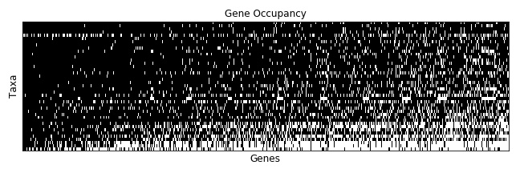

---
output:
  pdf_document:
    fig_caption: yes
---

## Supplementary Figures
\setcounter{figure}{0}
\setcounter{table}{0}
\makeatletter
\renewcommand{\thefigure}{S\@arabic\c@figure}
\renewcommand{\thetable}{S\@arabic\c@table}
\makeatother

####Agalma analysis

\pagebreak

####SOWH analysis

\pagebreak

#####Stochastic Character maps

